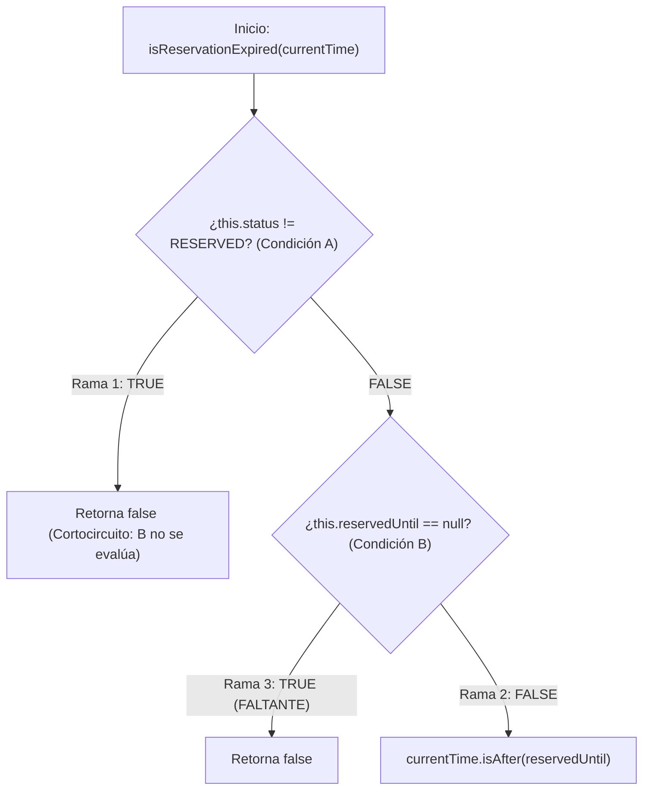

# 📊 Caso de Estudio y Análisis Técnico: Resolución del Camino Huérfano en JaCoCo (`Ticket.java`)

> **Documento de Investigación y Análisis de Cobertura de Código (Branch Coverage)**  
> *Proyecto ClickTuCasa — Unidad 1: Fundamentos de Calidad y TDD en Java*

---

## 📋 1. Resumen Ejecutivo del Problema

Durante el análisis de cobertura de código generado por el plugin **JaCoCo** (`jacoco-maven-plugin`), la suite de pruebas unitarias alcanzó inicialmente un 100% en cobertura de líneas (*Line Coverage*), pero registró un **98% en cobertura de ramas (*Branch Coverage*)** en el paquete `domain.model`.

Específicamente, en la vista HTML interactiva de JaCoCo (`target/site/jacoco/domain.model/Ticket.html`), la **línea 50** del método `isReservationExpired` en la clase `Ticket.java` presentaba un **diamante amarillo** (cobertura parcial de ramas), indicando que existía un **camino lógico huérfano** no evaluado por la suite de pruebas automatizadas.

---

## 🟡 2. ¿Qué significa la Simbología de JaCoCo?

JaCoCo utiliza tres indicadores de color para evaluar las decisiones lógicas en el bytecode compilado:

| Símbolo | Significado | Explicación Técnica |
|---|---|---|
| 🟢 **Diamante Verde** | **Rama Totalmente Cubierta** | Todas las combinaciones posibles de la condición lógica (`true` y `false`) fueron ejecutadas por al menos una prueba unitaria. |
| 🟡 **Diamante Amarillo** | **Rama Parcialmente Cubierta** | La línea fue ejecutada, pero **una o más combinaciones condicionales no fueron evaluadas** por ninguna prueba (camino huérfano). |
| 🔴 **Diamante Rojo** | **Rama No Cubierta** | Ninguna prueba unitaria pasó por esta decisión lógica. |

---

## 🔍 3. Análisis del Código Afectado

### Código Original en `Ticket.java`:

```java
public boolean isReservationExpired(LocalDateTime currentTime) {
    // Línea 50 con Diamante Amarillo en JaCoCo:
    if (this.status != TicketStatus.RESERVED || this.reservedUntil == null) {
        return false;
    }
    return currentTime.isAfter(this.reservedUntil);
}
```

---

## 🧮 4. Desglose Teórico del Bytecode y Matriz de Evaluaciones Booleanas

El operador lógico `||` (*OR lógico*) en Java utiliza **evaluación de cortocircuito** (*short-circuit evaluation*). En el nivel del bytecode compilado por la JVM, la instrucción `if (A || B)` se descompone internamente en **3 bifurcaciones de código**:



### Matriz de Pruebas Unitarias Inicial vs. Ramas Evaluadas

| Rama en Bytecode | Condición A (`status != RESERVED`) | Condición B (`reservedUntil == null`) | Prueba que la evaluaba inicialmente | Estado en JaCoCo Inicial |
|---|---|---|---|---|
| **Rama 1** | `TRUE` | *No evaluado (Cortocircuito)* | `shouldReturnFalseForExpirationWhenNotReserved()` | 🟢 Cubierta |
| **Rama 2** | `FALSE` | `FALSE` | `shouldCheckIfReservationIsExpired()` | 🟢 Cubierta |
| **Rama 3** | `FALSE` | `TRUE` | ❌ **Ninguna prueba ejecutaba esta combinación** | 🟡 **FALTANTE (Camino Huérfano)** |

---

## 🛠️ 5. Diagnóstico Riguroso: ¿Por qué ocurrió el camino huérfano?

En la suite de pruebas unitarias original:
1. La prueba `shouldReturnFalseForExpirationWhenNotReserved()` probaba un boleto en estado `AVAILABLE`. Como `this.status != TicketStatus.RESERVED` era `TRUE`, Java **interrumpía la evaluación (*short-circuit*) y no ejecutaba la comprobación de `reservedUntil == null`**.
2. La prueba `shouldCheckIfReservationIsExpired()` probaba un boleto reservado usando el método `ticket.reserve(...)`, el cual asigna tanto el estado `RESERVED` como una fecha válida en `reservedUntil`. Por lo tanto, `this.status != TicketStatus.RESERVED` era `FALSE` y `this.reservedUntil == null` era `FALSE`.
3. **Brecha de Cobertura**: No existía ninguna prueba que instanciara un `Ticket` directamente en estado `RESERVED` manteniendo el atributo `reservedUntil` en `null`.

---

## 💡 6. La Solución Aplicada (TDD & Refactorización)

Para resolver definitivamente el camino huérfano y alcanzar el **100% de Branch Coverage**, se aplicaron dos acciones complementarias:

### Acción 1: Refactorización en `Ticket.java` para Mayor Claridad Condicional

Separamos la expresión `||` en dos cláusulas de guarda (*Guard Clauses*) independientes. Esto elimina combinaciones booleanas complejas en una sola línea y facilita la lectura del bytecode para JaCoCo:

```java
public boolean isReservationExpired(LocalDateTime currentTime) {
    if (this.status != TicketStatus.RESERVED) {
        return false;
    }
    if (this.reservedUntil == null) {
        return false;
    }
    return currentTime.isAfter(this.reservedUntil);
}
```

### Acción 2: Incorporación de la Prueba Unitaria en `TicketTest.java`

Se redactó una prueba unitaria explícita bajo el **Patrón AAA (`// ARRANGE`, `// ACT`, `// ASSERT`)** para evaluar la segunda cláusula de guarda:

```java
@Test
@DisplayName("Should return false for isReservationExpired when status is RESERVED but reservedUntil is null")
void shouldReturnFalseForExpirationWhenReservedUntilIsNull() {
    // ARRANGE: Instanciamos un Ticket en estado RESERVED pero con reservedUntil en null
    Ticket ticket = new Ticket(300L, new BigDecimal("15.00"), TicketStatus.RESERVED);

    // ACT & ASSERT: Verificamos que retorne false al evaluar la expiración
    assertFalse(ticket.isReservationExpired(LocalDateTime.now()));
}
```

---

## 📈 7. Resultado Final de Cobertura en JaCoCo

Tras aplicar la prueba y refactorización, re-ejecutamos en la terminal:

```bash
mvn clean test
mvn jacoco:report
```

### Salida Real de JaCoCo en `target/site/jacoco/index.html`:

| Paquete | Instrucciones Cubiertas | Cobertura de Líneas | Cobertura de Ramas (Branches) | Ramas No Cubiertas |
|---|---|---|---|---|
| `domain.model` | **477 / 477** | **100%** 🟢 | **72 / 72 (100%)** 🟢 | **0** |
| `domain.service` | **247 / 247** | **100%** 🟢 | **46 / 46 (100%)** 🟢 | **0** |
| `domain.exception` | **20 / 20** | **100%** 🟢 | **N/A** | **0** |
| **TOTAL** | **744 / 744** | **100%** 🟢 | **118 / 118 (100%)** 🟢 | **0 (Cero Caminos Huérfanos)** |

---

## 🎓 8. Lecciones Aprendidas de Ingeniería de Software

1. **Diferencia entre Line Coverage y Branch Coverage**: Tener un 100% de líneas ejecutadas (*Line Coverage*) no garantiza que la lógica de negocio esté totalmente probada. Una sola línea con operadores booleanos (`||`, `&&`) o condicionales ternarios `? :` puede ocultar múltiples caminos huérfanos.
2. **Claridad sobre Complejidad**: Simplificar condicionales compuestos en cláusulas de guarda (*Guard Clauses*) independientes mejora la mantenibilidad, facilita la lectura por otros desarrolladores y permite que las herramientas de calidad (JaCoCo, SonarQube) midan las decisiones lógicas sin ambigüedades.
3. **Verificación Estricta en CI/CD**: La configuración del plugin JaCoCo con la regla `<minimum>1.00</minimum>` en `pom.xml` actuó como una red de seguridad, impidiendo dar por terminado el Hito 1 hasta garantizar la cobertura matemática absoluta.
