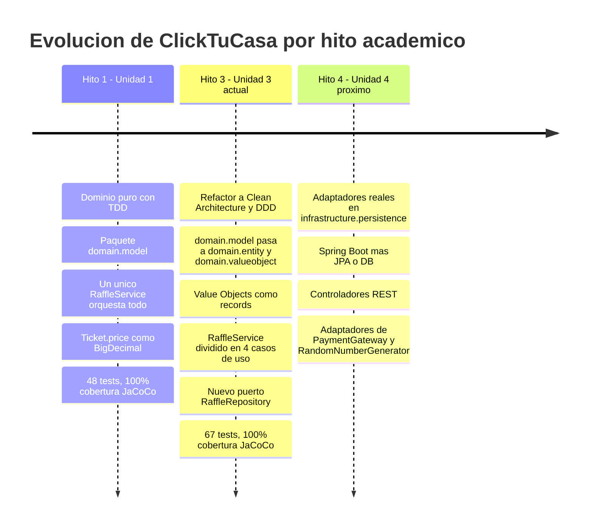
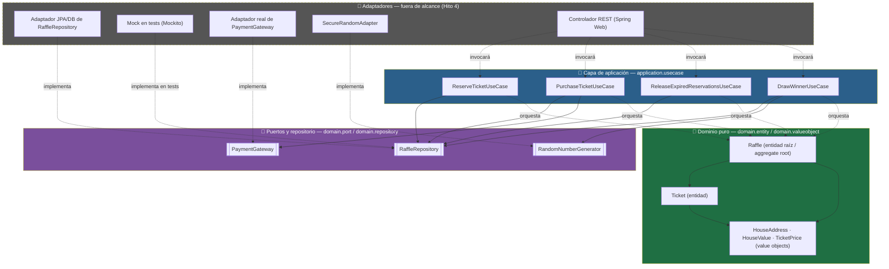
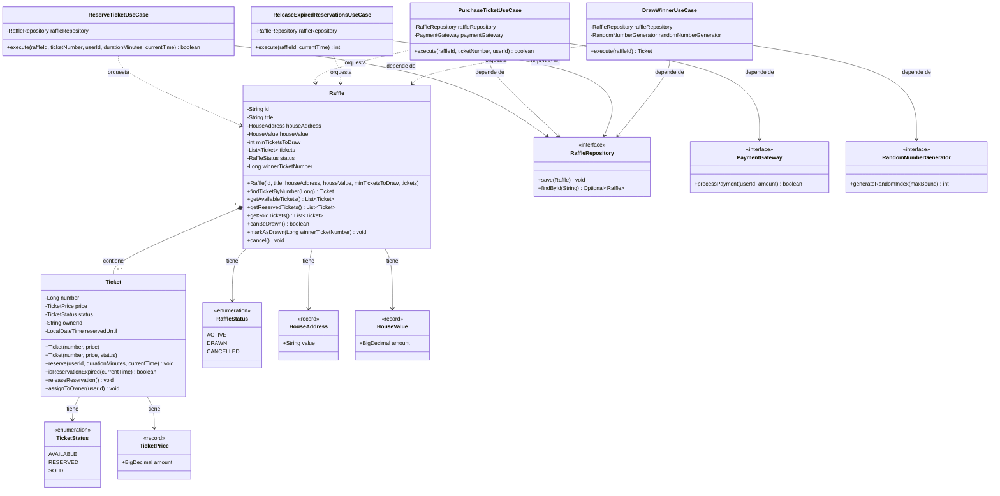
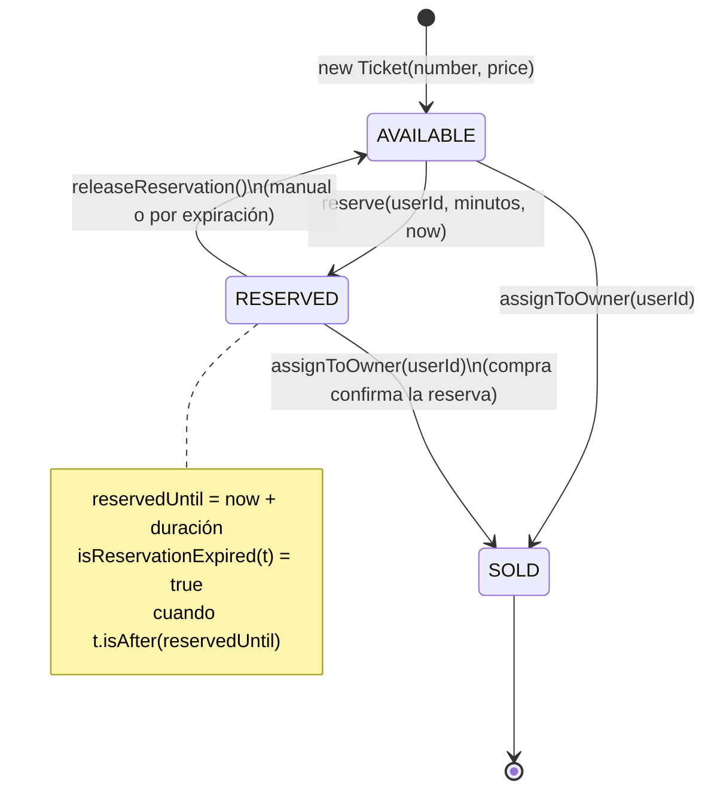
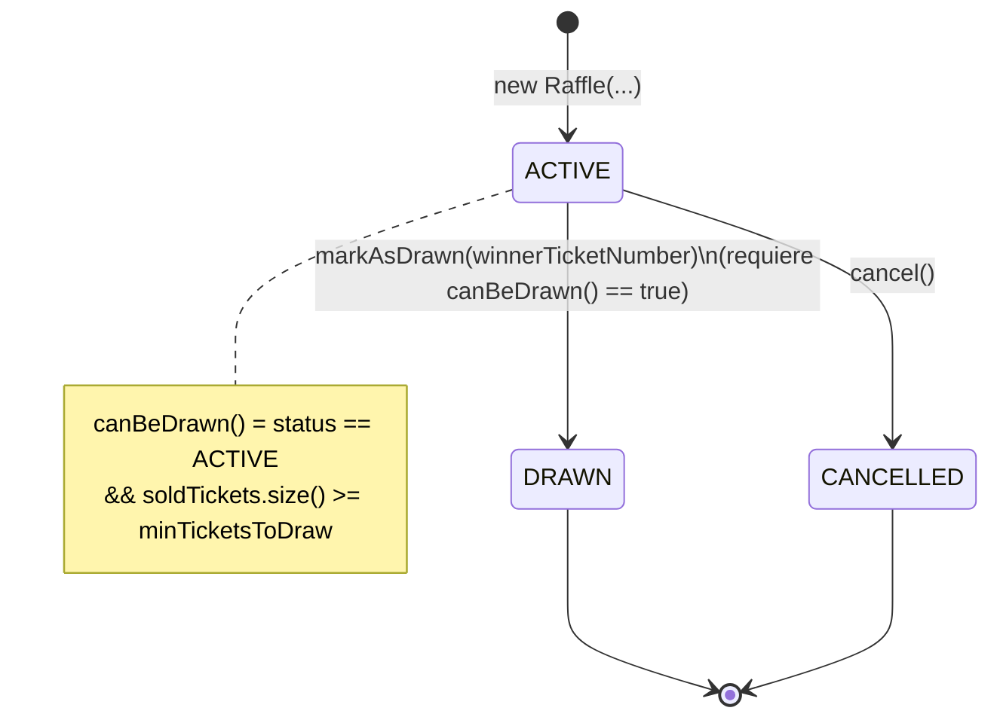
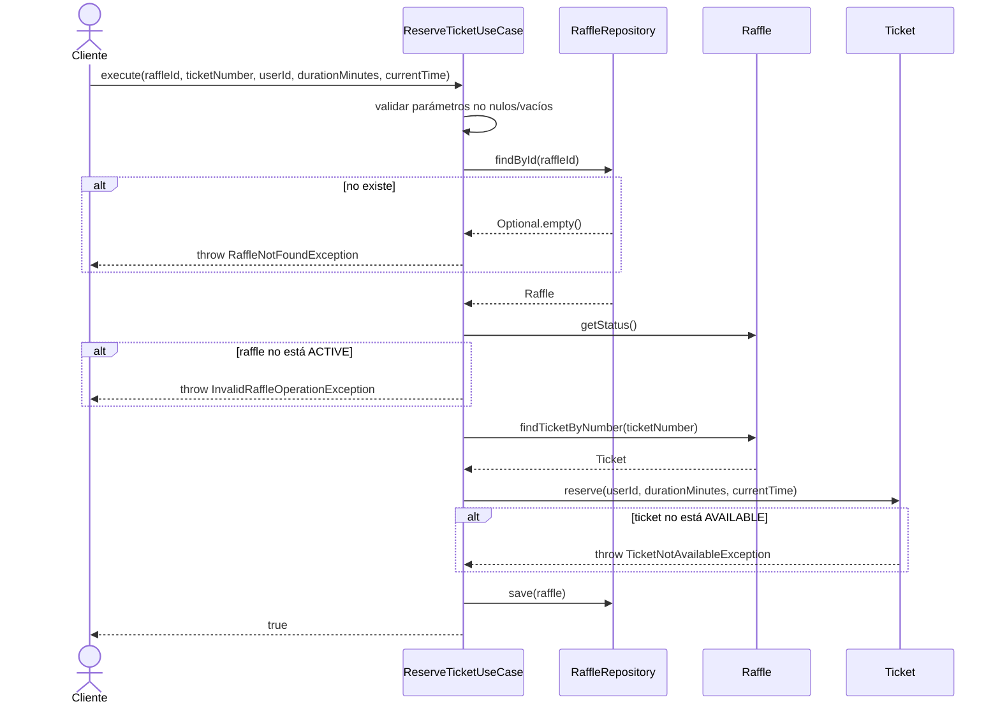
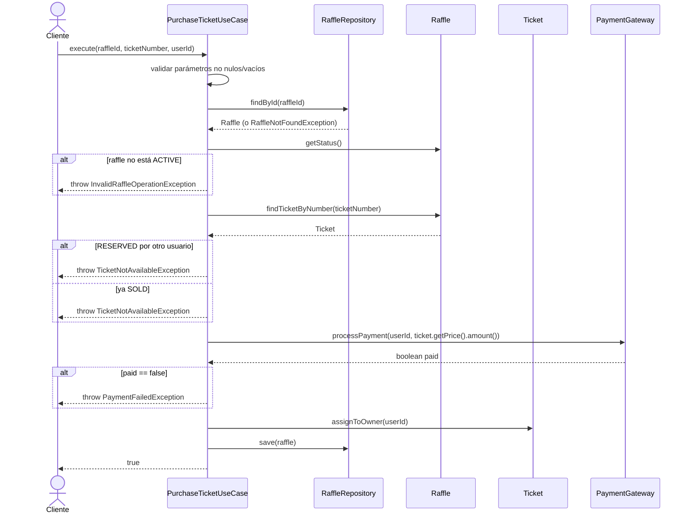
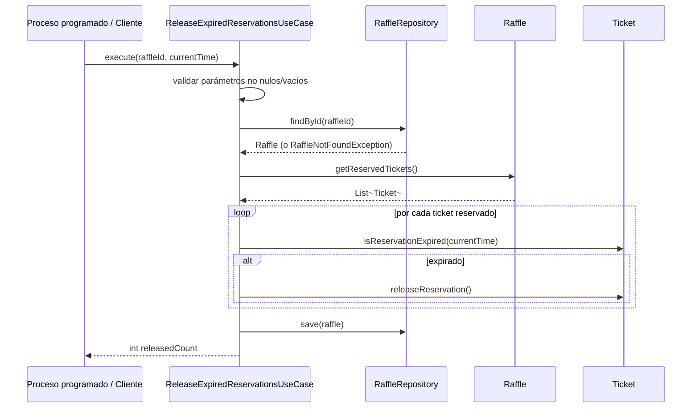
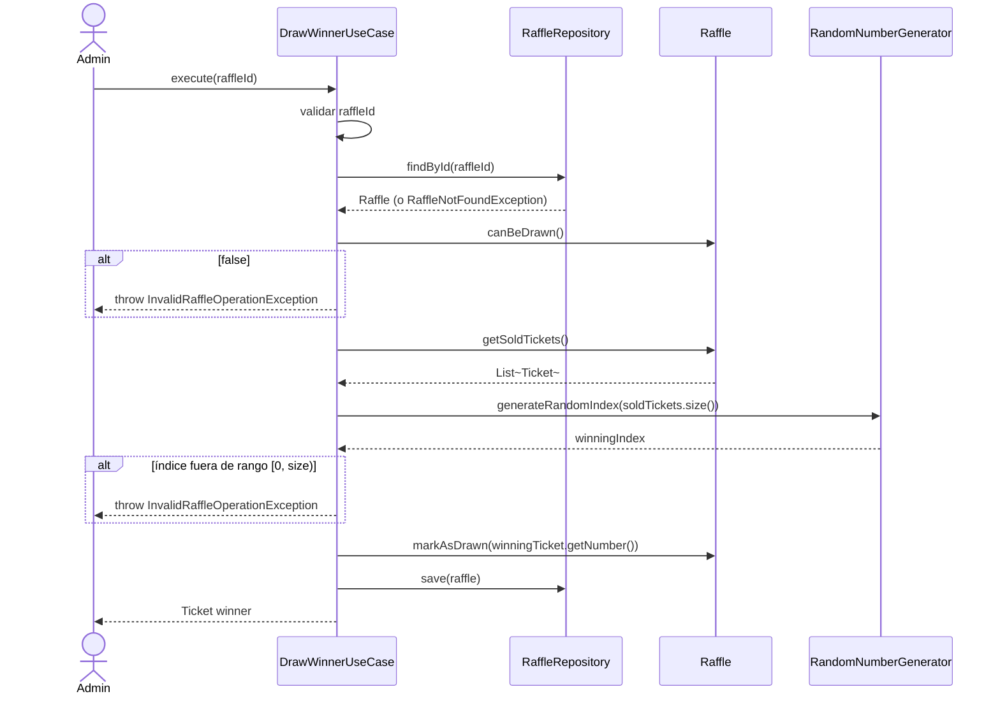

# 🏠 ClickTuCasa — Motor de Dominio de Rifas de Casas (Clean Architecture + DDD)

> **Unidad 3: Refactorización a Clean Architecture, Value Objects inmutables y Casos de Uso independientes — Suite JUnit 5 / Mockito con Cobertura 100% (JaCoCo)**
> *Programa Java — Globant Talento Ready / Desafío Latam*


> 📎 **Nota de versión.** Este documento describe el estado **vigente** del código (Unidad 3: Clean Architecture + DDD). La documentación original del **Hito 1** (Unidad 1, cuando el dominio vivía en `domain.model` y era orquestado por una única clase `RaffleService`) se conserva sin cambios, como anexo histórico, en **[README_HITO1.md](./README_HITO1.md)**.

---

## 📑 Tabla de contenidos

1. [Resumen del proyecto](#-1-resumen-del-proyecto)
2. [Línea de tiempo del proyecto (Hito 1 → Hito 4)](#-2-línea-de-tiempo-del-proyecto-hito-1--hito-4)
3. [Arquitectura: Clean Architecture + DDD + Ports & Adapters](#-3-arquitectura-clean-architecture--ddd--ports--adapters)
4. [Estructura de carpetas](#-4-estructura-de-carpetas)
5. [Modelo de dominio en profundidad](#-5-modelo-de-dominio-en-profundidad)
6. [Ciclos de vida: `Ticket` y `Raffle`](#-6-ciclos-de-vida-ticket-y-raffle)
7. [Reglas de negocio e invariantes](#-7-reglas-de-negocio-e-invariantes)
8. [Capa de aplicación: casos de uso](#-8-capa-de-aplicación-casos-de-uso)
9. [Puertos y contrato de persistencia](#-9-puertos-y-contrato-de-persistencia)
10. [Manejo de excepciones](#-10-manejo-de-excepciones)
11. [Estrategia de testing](#-11-estrategia-de-testing)
12. [Cobertura de código (JaCoCo)](#-12-cobertura-de-código-jacoco)
13. [Cómo ejecutar el proyecto](#-13-cómo-ejecutar-el-proyecto)
14. [Dependencias del proyecto](#-14-dependencias-del-proyecto)
15. [Decisiones de diseño y trade-offs](#-15-decisiones-de-diseño-y-trade-offs)
16. [Limitaciones conocidas y próximos pasos](#-16-limitaciones-conocidas-y-próximos-pasos)
17. [Anexos y documentación complementaria](#-17-anexos-y-documentación-complementaria)
18. [Créditos](#-18-créditos)

---

## 📋 1. Resumen del Proyecto

**ClickTuCasa** es el motor de dominio puro (*Pure Domain Core*) de una plataforma de rifas de casas: se emiten boletos numerados para una vivienda determinada, los usuarios los reservan o compran, y al alcanzar un mínimo de boletos vendidos se sortea un ganador de forma transparente.

El backend se construyó originalmente en la **Unidad 1** aplicando **Test-Driven Development** (Java puro, JUnit 5, Mockito) y ha sido **refactorizado en la Unidad 3** para aplicar **Clean Architecture** y patrones tácticos de **Domain-Driven Design (DDD)**. El núcleo de negocio (`domain`) sigue siendo 100% independiente de frameworks, bases de datos y detalles de infraestructura: se comunica con el exterior exclusivamente a través de **interfaces** (puertos y repositorio), nunca al revés.

En términos de negocio, el sistema modela el ciclo de vida completo de una rifa:

- Una **rifa** (`Raffle`) se crea con un identificador, un título, la dirección y el valor de la vivienda (como *value objects* auto-validados), un mínimo de boletos a vender para poder sortear, y un conjunto fijo de **boletos** (`Ticket`).
- Un usuario puede **reservar** un boleto temporalmente (con expiración) o **comprarlo** directamente, lo que dispara un cobro a través de una pasarela de pago externa.
- Al alcanzar el mínimo de boletos vendidos, la rifa puede **sortearse**, eligiendo un boleto ganador entre los vendidos mediante un generador de números aleatorios externo.
- Una rifa puede **cancelarse** en cualquier momento antes de ser sorteada.
- Las reservas vencidas pueden **liberarse** en lote para devolver esos boletos al inventario disponible.

Cada uno de estos flujos de negocio es hoy un **caso de uso independiente** (`application.usecase`) que orquesta el dominio a través de un `RaffleRepository`, sin depender de ningún framework de persistencia concreto.

---

## 🎓 2. Línea de Tiempo del Proyecto (Hito 1 → Hito 4)



| Hito | Alcance | Documentación |
|---|---|---|
| **Hito 1** (Unidad 1) | Dominio puro con TDD; una clase `RaffleService` orquesta todo; sin value objects | [README_HITO1.md](./README_HITO1.md) *(anexo histórico)* |
| **Hito 3** (Unidad 3) — **vigente** | Clean Architecture + DDD táctico: entidades, value objects, puertos, repositorio y 4 casos de uso independientes | Este documento |
| **Hito 4** (Unidad 4, próximo) | Adaptadores reales en `infrastructure.persistence` (Spring Boot, JPA, REST) | *Pendiente* |

> 🔤 Todo el código fuente está escrito **100% en inglés**, tal como exige la rúbrica de evaluación; la documentación (README y análisis) está en español para facilitar la revisión académica.

---

## 🏛️ 3. Arquitectura: Clean Architecture + DDD + Ports & Adapters

El dominio (`domain`) es el centro del sistema. La capa de aplicación (`application.usecase`) lo orquesta. Ambas capas **desconocen** cómo se persisten los datos o cómo se conectan los adaptadores externos: solo dependen de interfaces (`RaffleRepository`, `PaymentGateway`, `RandomNumberGenerator`) definidas dentro del propio dominio. En este hito **no existen adaptadores concretos**: se definen los contratos y se simulan con **mocks de Mockito** en los tests; `infrastructure.persistence` es, por ahora, un paquete vacío documentado con `package-info.java`, reservado para el Hito 4.

### 3.1 Diagrama de capas (mermaid)



### 3.2 Diagrama hexagonal (ASCII)

```text
                         ┌───────────────────────────────────────────────┐
                         │            infrastructure (Hito 4)            │
                         │   REST Controllers · Spring Boot · JPA/DB      │
                         │           (aún no implementado)                │
                         └───────────────────────┬─────────────────────--┘
                                                  │ invoca
                                                  ▼
                         ┌───────────────────────────────────────────────┐
                         │        application.usecase (Hito 3)           │
                         │  ReserveTicketUseCase   PurchaseTicketUseCase  │
                         │  ReleaseExpiredReservationsUseCase             │
                         │  DrawWinnerUseCase                             │
                         └───────┬───────────────────────────┬───────────┘
                                 │ usa                        │ usa
                 ┌───────────────▼──────────────┐   ┌─────────▼───────────┐
                 │   domain.repository (puerto) │   │  domain.port         │
                 │   RaffleRepository            │   │  PaymentGateway      │
                 │   save() / findById()         │   │  RandomNumberGenerator│
                 └───────────────┬───────────────┘   └─────────┬───────────┘
                                 │ persiste / consulta          │ delega
                                 ▼                               ▼
                 ┌───────────────────────────────────────────────────────┐
                 │                 domain (núcleo puro)                  │
                 │   entity: Raffle, Ticket, RaffleStatus, TicketStatus  │
                 │   valueobject: HouseAddress, HouseValue, TicketPrice  │
                 │   exception: 8 excepciones de negocio                 │
                 │        — cero frameworks, cero anotaciones técnicas — │
                 └───────────────────────────────────────────────────────┘
```

### 3.3 Principios de diseño aplicados

- **Zero Frameworks Mágicos**: Java 17 puro, sin anotaciones de persistencia ni inyección de dependencias de ningún framework.
- **Inyección por constructor**: cada caso de uso recibe sus dependencias (`RaffleRepository` y, según el flujo, `PaymentGateway` o `RandomNumberGenerator`) obligatoriamente en el constructor y las valida con `Objects.requireNonNull`.
- **Inversión de dependencias**: el dominio define las interfaces (`domain.port`, `domain.repository`); las implementaciones concretas dependerán del dominio, nunca al revés.
- **Un caso de uso, una responsabilidad**: cada clase de `application.usecase` resuelve **un único flujo de negocio** (*Single Responsibility Principle*), en vez de un servicio monolítico con múltiples métodos.
- **Value Objects auto-validantes**: `TicketPrice`, `HouseValue` y `HouseAddress` son `record` de Java con constructor compacto que valida su propia invariante — ya no existen `BigDecimal`/`String` sueltos representando conceptos de negocio.
- **Entidades ricas, no anémicas**: `Raffle` y `Ticket` protegen sus propios invariantes (validaciones en constructor y en cada método de transición de estado), en vez de exponer setters públicos.
- **Inmutabilidad donde aplica**: campos identificadores (`id`, `number`, `price`, etc.) son `final`; `getTickets()` devuelve una vista `Collections.unmodifiableList(...)`; los value objects son inmutables por naturaleza (`record`).
- **Patrón AAA estricto**: los 67 tests JUnit 5 están segmentados con `// ARRANGE`, `// ACT`, `// ASSERT`.
- **Aislamiento con Mockito**: los tests de casos de uso simulan `RaffleRepository`, `PaymentGateway` y `RandomNumberGenerator` con `@Mock`, `when(...).thenReturn(...)` y `verify(...)`.
- **Excepciones de negocio explícitas**: cada regla violada lanza una excepción de dominio específica, verificada con `assertThrows`.

---

## 📂 4. Estructura de Carpetas

```text
Hito de la unidad 01 Fundamentos de Calidad y TDD en JAVA/
├── pom.xml                                    # Configuración Maven: deps, compiler, JaCoCo
├── README.md                                  # Este documento (versión vigente — Hito 3)
├── README_HITO1.md                            # 📎 Anexo histórico: documentación original del Hito 1
├── ANALISIS_COBERTURA_JACOCO_RESOLUCION.md     # Caso de estudio: rama huérfana en Ticket.java (Hito 1)
│
├── src/
│   ├── main/java/com/clicktucasa/
│   │   ├── domain/                             # Núcleo puro: cero frameworks, cero anotaciones técnicas
│   │   │   ├── entity/
│   │   │   │   ├── Raffle.java                 # Entidad raíz (aggregate root): agrega Tickets, controla el sorteo
│   │   │   │   ├── RaffleStatus.java           # enum: ACTIVE, DRAWN, CANCELLED
│   │   │   │   ├── Ticket.java                 # Entidad: reserva, compra, expiración
│   │   │   │   └── TicketStatus.java           # enum: AVAILABLE, RESERVED, SOLD
│   │   │   │
│   │   │   ├── valueobject/                    # records inmutables y auto-validantes
│   │   │   │   ├── HouseAddress.java           # Dirección de la vivienda (no vacía)
│   │   │   │   ├── HouseValue.java             # Valor tasado de la vivienda (> 0)
│   │   │   │   └── TicketPrice.java            # Precio del boleto (> 0)
│   │   │   │
│   │   │   ├── exception/                      # 8 excepciones de negocio (unchecked)
│   │   │   │   ├── InvalidHouseAddressException.java
│   │   │   │   ├── InvalidHouseValueException.java
│   │   │   │   ├── InvalidRaffleOperationException.java
│   │   │   │   ├── InvalidTicketPriceException.java
│   │   │   │   ├── PaymentFailedException.java
│   │   │   │   ├── RaffleNotFoundException.java
│   │   │   │   ├── TicketNotAvailableException.java
│   │   │   │   └── TicketNotFoundException.java
│   │   │   │
│   │   │   ├── port/                           # Contratos hacia servicios externos (no persistencia)
│   │   │   │   ├── PaymentGateway.java         # Puerto de salida: procesar pagos
│   │   │   │   └── RandomNumberGenerator.java  # Puerto de salida: aleatoriedad del sorteo
│   │   │   │
│   │   │   └── repository/
│   │   │       └── RaffleRepository.java       # Puerto de persistencia: save(Raffle) / findById(id)
│   │   │
│   │   ├── application/
│   │   │   └── usecase/                        # Un caso de uso = un flujo de negocio completo
│   │   │       ├── ReserveTicketUseCase.java
│   │   │       ├── PurchaseTicketUseCase.java
│   │   │       ├── ReleaseExpiredReservationsUseCase.java
│   │   │       └── DrawWinnerUseCase.java
│   │   │
│   │   └── infrastructure/
│   │       └── persistence/
│   │           └── package-info.java           # Placeholder documentado — implementación real en Hito 4
│   │
│   └── test/java/com/clicktucasa/
│       ├── domain/
│       │   ├── entity/
│       │   │   ├── RaffleTest.java             # 14 tests
│       │   │   └── TicketTest.java             # 16 tests
│       │   └── valueobject/
│       │       ├── HouseAddressTest.java       # 3 tests
│       │       ├── HouseValueTest.java         # 4 tests
│       │       └── TicketPriceTest.java        # 5 tests
│       └── application/
│           └── usecase/
│               ├── ReserveTicketUseCaseTest.java              # 5 tests
│               ├── PurchaseTicketUseCaseTest.java              # 9 tests
│               ├── ReleaseExpiredReservationsUseCaseTest.java  # 4 tests
│               └── DrawWinnerUseCaseTest.java                  # 7 tests
│
└── target/site/jacoco/                         # Reporte HTML de cobertura (generado por Maven)
```

> 💡 **Nota sobre el "Pilar 3" del hito.** `infrastructure.persistence` contiene únicamente un `package-info.java`: es intencional. Los casos de uso dependen solo de la interfaz `RaffleRepository` (inyectada por constructor) y están completamente probados con Mockito contra esa abstracción — no se necesita una base de datos real para que el dominio y la capa de aplicación estén completos y verificables en este hito.

---

## 🧬 5. Modelo de Dominio en Profundidad

### 5.1 Diagrama de clases completo



### 5.2 Entidades (`domain.entity`)

| Clase | Rol DDD | Responsabilidad |
|---|---|---|
| `Raffle` | **Entidad raíz / Aggregate Root** | Agrega la lista de `Ticket`, es la única puerta de entrada para mutar el estado de la rifa y de sus boletos vendidos/sorteados; protege el invariante `canBeDrawn()`. |
| `Ticket` | **Entidad** | Representa un boleto individual con identidad propia (`number`); controla su propio ciclo de reserva/compra/expiración. |
| `RaffleStatus` | **Enum de estado** | `ACTIVE`, `DRAWN`, `CANCELLED`. |
| `TicketStatus` | **Enum de estado** | `AVAILABLE`, `RESERVED`, `SOLD`. |

### 5.3 Value Objects (`domain.valueobject`)

La refactorización de la Unidad 3 introdujo tres `record` inmutables que **reemplazan primitivos sueltos** (`BigDecimal`, `String`) por tipos que se auto-validan en su constructor compacto, evitando que un valor inválido llegue a existir en el sistema:

| Value Object | Encapsula | Regla auto-validada | Excepción |
|---|---|---|---|
| `TicketPrice(BigDecimal amount)` | El precio de un boleto | `amount` no nulo y `> 0` | `InvalidTicketPriceException` |
| `HouseValue(BigDecimal amount)` | El valor tasado de la vivienda | `amount` no nulo y `> 0` | `InvalidHouseValueException` |
| `HouseAddress(String value)` | La dirección de la vivienda | `value` no nulo/no vacío (se aplica `trim()`) | `InvalidHouseAddressException` |

```java
// Ejemplo real: constructor compacto de HouseAddress
public record HouseAddress(String value) {
    public HouseAddress {
        if (value == null || value.trim().isEmpty()) {
            throw new InvalidHouseAddressException("House address cannot be empty");
        }
        value = value.trim();
    }
}
```

> Al ser `record`, cada value object obtiene automáticamente `equals()`, `hashCode()` y `toString()` basados en su valor — dos `TicketPrice` con el mismo `amount` son iguales por valor, no por identidad de referencia, tal como exige la definición canónica de Value Object en DDD.

---

## 🔄 6. Ciclos de Vida: `Ticket` y `Raffle`

### 6.1 Ciclo de vida de un `Ticket`



### 6.2 Ciclo de vida de un `Raffle`



> ⚠️ **Asimetría intencional**: un `Raffle` **DRAWN** es un estado terminal — no puede cancelarse ni volver a sortearse — mientras que un `Ticket` **SOLD** también es terminal dentro de su propio ciclo de vida (no puede liberarse ni re-reservarse). Ningún método de `Raffle` o `Ticket` permite retroceder desde un estado terminal.

---

## ⚖️ 7. Reglas de Negocio e Invariantes

### `HouseAddress` / `HouseValue` / `TicketPrice` (value objects)

| # | Regla | Excepción si se viola |
|---|---|---|
| 1 | `HouseAddress.value` no puede ser nulo ni estar en blanco | `InvalidHouseAddressException` |
| 2 | `HouseValue.amount` no puede ser nulo y debe ser `> 0` | `InvalidHouseValueException` |
| 3 | `TicketPrice.amount` no puede ser nulo y debe ser `> 0` | `InvalidTicketPriceException` |

### `Ticket`

| # | Regla | Excepción si se viola |
|---|---|---|
| 1 | El número de boleto debe ser positivo (`> 0`) y no nulo | `IllegalArgumentException` |
| 2 | El precio (`TicketPrice`) no puede ser nulo | `IllegalArgumentException` *(la validez del monto ya la garantiza el value object)* |
| 3 | Solo puede reservarse un boleto en estado `AVAILABLE` | `TicketNotAvailableException` |
| 4 | `reserve()` exige `userId` no vacío y duración positiva | `IllegalArgumentException` |
| 5 | No puede asignarse (venderse) un boleto ya `SOLD` | `TicketNotAvailableException` |
| 6 | `releaseReservation()` es una operación *no-op* segura si el boleto no está `RESERVED` | — (no lanza excepción) |
| 7 | `isReservationExpired()` siempre retorna `false` si el estado no es `RESERVED` o si `reservedUntil` es `null` | — |

### `Raffle`

| # | Regla | Excepción si se viola |
|---|---|---|
| 1 | `id` y `title` no pueden ser nulos ni vacíos/en blanco | `IllegalArgumentException` |
| 2 | `houseAddress` (`HouseAddress`) no puede ser nulo | `IllegalArgumentException` |
| 3 | `houseValue` (`HouseValue`) no puede ser nulo | `IllegalArgumentException` |
| 4 | `minTicketsToDraw` debe ser positivo | `IllegalArgumentException` |
| 5 | La rifa debe crearse con al menos un boleto | `IllegalArgumentException` |
| 6 | Solo puede sortearse (`markAsDrawn`) una rifa `ACTIVE` que cumpla `canBeDrawn()` | `InvalidRaffleOperationException` |
| 7 | El boleto ganador debe estar en estado `SOLD` | `InvalidRaffleOperationException` |
| 8 | No puede cancelarse una rifa ya `DRAWN` | `InvalidRaffleOperationException` |
| 9 | `getTickets()` expone una lista **inmodificable** para evitar mutaciones externas no controladas | — |
| 10 | Búsquedas de boletos inexistentes lanzan una excepción específica en vez de retornar `null` | `TicketNotFoundException` |

### Casos de uso (`application.usecase`) — reglas de orquestación

| # | Regla | Excepción si se viola |
|---|---|---|
| 1 | Todos los casos de uso validan sus parámetros de entrada antes de tocar el repositorio | `IllegalArgumentException` |
| 2 | Todos los constructores de casos de uso rechazan dependencias nulas | `NullPointerException` (vía `Objects.requireNonNull`) |
| 3 | Si el `raffleId` no existe en el `RaffleRepository`, ningún caso de uso continúa | `RaffleNotFoundException` |
| 4 | No se puede reservar ni comprar en una rifa que no esté `ACTIVE` | `InvalidRaffleOperationException` |
| 5 | Un boleto `RESERVED` por **otro** usuario no puede ser comprado por un tercero | `TicketNotAvailableException` |
| 6 | Un boleto `RESERVED` por el **mismo** usuario sí puede completarse como compra | — (camino feliz) |
| 7 | Si `PaymentGateway.processPayment(...)` retorna `false`, el boleto **no cambia de estado** y **no se persiste** | `PaymentFailedException` |
| 8 | El índice generado por `RandomNumberGenerator` debe estar dentro de `[0, soldTickets.size())` | `InvalidRaffleOperationException` |
| 9 | Cada caso de uso llama a `raffleRepository.save(raffle)` **solo** tras completar su operación con éxito | — |

---

## 🎯 8. Capa de Aplicación: Casos de Uso

A diferencia del Hito 1 (donde una única clase `RaffleService` concentraba los cuatro flujos), en el Hito 3 cada flujo de negocio es una **clase independiente con una sola responsabilidad**, siguiendo el patrón *Use Case* / *Interactor* de Clean Architecture. Cada caso de uso:

1. Recibe sus dependencias (`RaffleRepository` y, si aplica, `PaymentGateway` o `RandomNumberGenerator`) **por constructor**, validadas con `Objects.requireNonNull`.
2. Valida sus parámetros de entrada **antes** de tocar el repositorio.
3. Recupera el `Raffle` vía `raffleRepository.findById(id)`, lanzando `RaffleNotFoundException` si no existe.
4. Delega las reglas de negocio a `Raffle`/`Ticket` (nunca las reimplementa).
5. Persiste el agregado modificado con `raffleRepository.save(raffle)`.

| Caso de uso | Propósito | Colabora con |
|---|---|---|
| `ReserveTicketUseCase` | Reserva temporalmente un boleto para un usuario | `RaffleRepository`, `Raffle`, `Ticket` |
| `PurchaseTicketUseCase` | Compra un boleto, cobrando a través del `PaymentGateway` | `RaffleRepository`, `PaymentGateway`, `Raffle`, `Ticket` |
| `ReleaseExpiredReservationsUseCase` | Libera todas las reservas vencidas de una rifa | `RaffleRepository`, `Raffle`, `Ticket` |
| `DrawWinnerUseCase` | Sortea un ganador entre los boletos vendidos usando `RandomNumberGenerator` | `RaffleRepository`, `RandomNumberGenerator`, `Raffle` |

### 8.1 Secuencia: reservar un boleto (`ReserveTicketUseCase.execute`)



### 8.2 Secuencia: comprar un boleto (`PurchaseTicketUseCase.execute`)



### 8.3 Secuencia: liberar reservas vencidas (`ReleaseExpiredReservationsUseCase.execute`)



### 8.4 Secuencia: sortear al ganador (`DrawWinnerUseCase.execute`)



---

## 🔌 9. Puertos y Contrato de Persistencia

Tres interfaces conforman la frontera del dominio hacia el exterior. Ninguna de las tres tiene una implementación de producción todavía; en los tests se simulan con Mockito.

| Interfaz | Paquete | Propósito | Método(s) |
|---|---|---|---|
| `RaffleRepository` | `domain.repository` | Contrato puro de persistencia del agregado `Raffle` | `void save(Raffle)` · `Optional<Raffle> findById(String id)` |
| `PaymentGateway` | `domain.port` | Procesa el cobro de un boleto comprado | `boolean processPayment(String userId, BigDecimal amount)` |
| `RandomNumberGenerator` | `domain.port` | Provee aleatoriedad para el sorteo del ganador | `int generateRandomIndex(int maxBound)` |

```java
// domain/repository/RaffleRepository.java
public interface RaffleRepository {
    void save(Raffle raffle);
    Optional<Raffle> findById(String id);
}
```

> 🧭 **Por qué `RaffleRepository` vive en `domain.repository` y no en `domain.port`.** Se separan conceptualmente los contratos de **persistencia** (`repository`, siguiendo el vocabulario táctico de DDD para el patrón *Repository*) de los contratos hacia **servicios externos no relacionados con guardar/leer el agregado** (`port`, p. ej. pagos y aleatoriedad). Ambos, sin embargo, cumplen exactamente el mismo rol arquitectónico: son *puertos de salida* del hexágono.

---

## 🚨 10. Manejo de Excepciones

Las 8 excepciones de negocio son **unchecked** (extienden `RuntimeException`), siguiendo la convención de que las reglas de dominio violadas son errores de flujo/negocio, no condiciones recuperables que deban forzarse a manejar en tiempo de compilación.

| Excepción | Paquete | Se lanza cuando… |
|---|---|---|
| `InvalidHouseAddressException` | `domain.exception` | La dirección de una vivienda (`HouseAddress`) es nula o está en blanco |
| `InvalidHouseValueException` | `domain.exception` | El valor tasado de una vivienda (`HouseValue`) es nulo, cero o negativo |
| `InvalidTicketPriceException` | `domain.exception` | El precio de un boleto (`TicketPrice`) es nulo, cero o negativo |
| `TicketNotAvailableException` | `domain.exception` | Se intenta reservar/comprar/asignar un boleto que no está en un estado válido para la operación |
| `TicketNotFoundException` | `domain.exception` | Se busca un `ticketNumber` que no existe dentro de la rifa |
| `RaffleNotFoundException` | `domain.exception` | Un caso de uso busca un `raffleId` que el `RaffleRepository` no tiene almacenado |
| `InvalidRaffleOperationException` | `domain.exception` | Se intenta sortear o cancelar una rifa en un estado incompatible, o el sorteo no cumple sus precondiciones |
| `PaymentFailedException` | `domain.exception` | El `PaymentGateway` externo rechaza el pago |
| `IllegalArgumentException` *(nativa de Java)* | — | Parámetros de entrada nulos, vacíos o fuera de rango en constructores y métodos públicos |
| `NullPointerException` *(vía `Objects.requireNonNull`)* | — | Se instancia un caso de uso con alguna dependencia nula |

---

## 🧪 11. Estrategia de Testing

El proyecto sigue **Test-Driven Development (TDD)** con **JUnit 5** y **Mockito** para aislar cada caso de uso de sus dependencias externas (`RaffleRepository`, `PaymentGateway`, `RandomNumberGenerator`).

### 11.1 Convenciones aplicadas

- **Patrón AAA explícito**: cada test está comentado con `// ARRANGE`, `// ACT`, `// ASSERT` (o `// ACT & ASSERT` cuando la acción y la verificación son atómicas, como en `assertThrows`).
- **Nombres descriptivos + `@DisplayName`**: cada test documenta en lenguaje natural el comportamiento esperado, facilitando la lectura del reporte de Surefire.
- **Mocks con `@ExtendWith(MockitoExtension.class)`**: cada `*UseCaseTest` inyecta `RaffleRepository` y, si aplica, `PaymentGateway`/`RandomNumberGenerator` simulados con `@Mock`.
- **Verificación de interacciones**: se usa `verify(...)` (y la ausencia de interacciones no deseadas) para confirmar, por ejemplo, que `raffleRepository.save(...)` **no** se invoca si el pago falla, o que el gateway de pago **no** se invoca si la validación de parámetros falla antes.
- **Cobertura de caminos huérfanos**: se investigan explícitamente las ramas de operadores booleanos compuestos (`||`, `&&`) — ver el caso de estudio heredado del Hito 1 en [ANALISIS_COBERTURA_JACOCO_RESOLUCION.md](ANALISIS_COBERTURA_JACOCO_RESOLUCION.md).

### 11.2 Inventario de la suite de pruebas (67 tests)

| Paquete | Clase de test | Tests | Qué cubre |
|---|---|---:|---|
| `domain.entity` | `TicketTest` | 16 | Constructores, validaciones, reserva, expiración, liberación, asignación a dueño |
| `domain.entity` | `RaffleTest` | 14 | Constructor, invariantes, búsqueda de boletos, categorización por estado, sorteo, cancelación |
| `domain.valueobject` | `TicketPriceTest` | 5 | Validación del constructor compacto del record (monto nulo, cero, negativo, positivo) |
| `domain.valueobject` | `HouseValueTest` | 4 | Validación del constructor compacto del record |
| `domain.valueobject` | `HouseAddressTest` | 3 | Validación del constructor compacto del record (incluye `trim()`) |
| `application.usecase` | `PurchaseTicketUseCaseTest` | 9 | Camino feliz, pago rechazado, ticket ya vendido/reservado por otro, raffle no ACTIVE, dependencias nulas |
| `application.usecase` | `DrawWinnerUseCaseTest` | 7 | Sorteo exitoso, raffle no elegible, índice fuera de rango, raffle inexistente, dependencias nulas |
| `application.usecase` | `ReserveTicketUseCaseTest` | 5 | Reserva exitosa, raffle no ACTIVE, raffle inexistente, parámetros inválidos |
| `application.usecase` | `ReleaseExpiredReservationsUseCaseTest` | 4 | Liberación selectiva de reservas vencidas, conteo, persistencia |
| **Total** | — | **67** | Dominio completo (entidades + value objects + casos de uso) |

Para ejecutar la suite y ver el detalle de cada test:

```bash
mvn clean test
```

Los reportes por clase quedan disponibles en `target/surefire-reports/`.

---

## 📊 12. Cobertura de Código (JaCoCo)

El `pom.xml` configura una **regla de verificación (`check`) a nivel de CLASE** que exige `minimum = 1.00` (100%) tanto en cobertura de **líneas** como de **ramas**. Si esta regla no se cumple, `mvn verify` falla el build — es una red de seguridad de calidad, no solo un reporte informativo.

### 12.1 Resultado real de cobertura (extraído de `target/site/jacoco/jacoco.csv`)

| Paquete | Clase | Instrucciones | Ramas | Líneas | Métodos |
|---|---|---:|---:|---:|---:|
| `domain.entity` | `Raffle` | 257/257 (100%) | 38/38 (100%) | 60/60 (100%) | 21/21 |
| `domain.entity` | `Ticket` | 166/166 (100%) | 28/28 (100%) | 44/44 (100%) | 11/11 |
| `domain.entity` | `RaffleStatus` | 21/21 (100%) | N/A | 4/4 (100%) | 1/1 |
| `domain.entity` | `TicketStatus` | 21/21 (100%) | N/A | 4/4 (100%) | 1/1 |
| `domain.valueobject` | `TicketPrice` | 17/17 (100%) | 4/4 (100%) | 4/4 (100%) | 1/1 |
| `domain.valueobject` | `HouseValue` | 17/17 (100%) | 4/4 (100%) | 4/4 (100%) | 1/1 |
| `domain.valueobject` | `HouseAddress` | 20/20 (100%) | 4/4 (100%) | 5/5 (100%) | 1/1 |
| `domain.exception` | 8 clases | 4/4 c/u (100%) | N/A | 2/2 c/u (100%) | 1/1 c/u |
| `application.usecase` | `PurchaseTicketUseCase` | 125/125 (100%) | 20/20 (100%) | 25/25 (100%) | 3/3 |
| `application.usecase` | `ReserveTicketUseCase` | 86/86 (100%) | 14/14 (100%) | 19/19 (100%) | 3/3 |
| `application.usecase` | `DrawWinnerUseCase` | 84/84 (100%) | 10/10 (100%) | 18/18 (100%) | 3/3 |
| `application.usecase` | `ReleaseExpiredReservationsUseCase` | 71/71 (100%) | 10/10 (100%) | 18/18 (100%) | 3/3 |
| **TOTAL** | — | **917/917 (100%)** | **132/132 (100%)** | **221/221 (100%)** | **48/48** |

Para generar y visualizar el reporte HTML interactivo localmente:

```bash
mvn clean test
mvn jacoco:report
```

Luego abrir en el navegador:

```text
target/site/jacoco/index.html
```

### 12.2 Caso de estudio heredado: cobertura de ramas

Durante el desarrollo del Hito 1, `Ticket.isReservationExpired()` quedó inicialmente con cobertura de ramas incompleta debido a un camino huérfano en la condición compuesta `if (status != RESERVED || reservedUntil == null)`. La solución aplicada entonces (separar la condición en dos *guard clauses* y agregar un test dedicado) sigue vigente en el código actual y es la razón por la que la clase `Ticket` mantiene 100% de cobertura de ramas incluso tras la refactorización de la Unidad 3. El análisis completo — con la matriz de evaluación booleana y el diagrama de bifurcación de bytecode — está documentado en:

📄 **[ANALISIS_COBERTURA_JACOCO_RESOLUCION.md](ANALISIS_COBERTURA_JACOCO_RESOLUCION.md)** *(caso de estudio del Hito 1; los nombres de paquete que menciona, `domain.model`/`domain.service`, corresponden a la estructura de esa época — ver [línea de tiempo](#-2-línea-de-tiempo-del-proyecto-hito-1--hito-4)).*

---

## 🚀 13. Cómo Ejecutar el Proyecto

### 13.1 Requisitos previos

- **JDK 17** o superior (el proyecto compila con `source`/`target` = 17; es compatible con ejecutarse bajo JDK 21)
- **Apache Maven 3.8+**
- No requiere base de datos, contenedores ni variables de entorno — es un módulo Maven autocontenido, sin dependencias de producción (solo dependencias de `test`)

### 13.2 Comandos principales

```bash
# Compilar el proyecto
mvn compile

# Ejecutar toda la suite de pruebas automatizadas (JUnit 5 + Mockito) — 67 tests
mvn clean test

# Generar el reporte de cobertura de código en formato HTML (JaCoCo)
mvn jacoco:report

# Ejecutar tests + generar reporte + validar la regla de cobertura 100% (falla el build si no se cumple)
mvn clean verify
```

> ℹ️ Este módulo **no expone un `main`/punto de entrada ejecutable**: es intencional, ya que en este hito el objetivo es entregar un núcleo de dominio y una capa de aplicación 100% verificados por tests, sin un adaptador (CLI, REST) que los invoque todavía.

---

## 📦 14. Dependencias del Proyecto

`groupId`: `com.clicktucasa` · `artifactId`: `clicktucasa` · `version`: `1.0.0-SNAPSHOT`

| Dependencia / plugin | Versión | Alcance | Uso |
|---|---|---|---|
| `junit-jupiter-api` / `-engine` / `-params` | 5.10.2 | `test` | Framework de pruebas JUnit 5 |
| `mockito-core` | 5.11.0 | `test` | Mocking de `RaffleRepository`, `PaymentGateway`, `RandomNumberGenerator` |
| `mockito-junit-jupiter` | 5.11.0 | `test` | Integración `@ExtendWith(MockitoExtension.class)` |
| `maven-compiler-plugin` | 3.13.0 | build | Compilación con `source`/`target` = 17 |
| `maven-surefire-plugin` | 3.2.5 | build | Ejecución de la suite de tests |
| `jacoco-maven-plugin` | 0.8.11 | build | Cobertura de código + regla de verificación (`check`, `CLASS`, `minimum=1.00` en `LINE` y `BRANCH`) |

> El proyecto **no declara ninguna dependencia de producción** (`compile`/`runtime`): todo lo que se agrega vive en `scope=test`, reforzando que el dominio y la capa de aplicación son Java puro sin acoplamiento a frameworks.

---

## 🧭 15. Decisiones de Diseño y Trade-offs

- **¿Por qué migrar de `BigDecimal`/`String` sueltos a Value Objects (`record`)?** Un `BigDecimal` negativo o un `String` vacío son estados que el compilador permite pero el negocio prohíbe. Envolverlos en `TicketPrice`, `HouseValue` y `HouseAddress` hace que un valor inválido **no pueda existir** una vez construido el objeto — "parse, don't validate" aplicado con records de Java 17.
- **¿Por qué dividir `RaffleService` en 4 casos de uso independientes?** Cada flujo de negocio (reservar, comprar, liberar reservas, sortear) tiene sus propias dependencias, sus propios errores y su propio ciclo de cambio. Separarlos en clases `execute(...)` de una sola responsabilidad reduce el acoplamiento entre flujos y facilita testear/extender uno sin afectar a los demás — el patrón *Use Case / Interactor* de Clean Architecture.
- **¿Por qué introducir `RaffleRepository` en este hito?** Para que los casos de uso puedan operar sobre rifas identificadas por `id` (`execute(raffleId, ...)`) en vez de recibir el objeto `Raffle` completo como parámetro (como hacía `RaffleService` en el Hito 1). Esto modela con más fidelidad cómo lucirá la capa de aplicación una vez conectada a un controlador REST real en el Hito 4.
- **¿Por qué no usar Lombok?** Se optó por `record` (para value objects) y clases explícitas con constructores validados y getters manuales (para entidades) para maximizar la legibilidad pedagógica de las invariantes de negocio, sin añadir una dependencia de generación de código en tiempo de compilación.
- **¿Por qué excepciones unchecked en vez de checked?** Las excepciones de dominio representan violaciones de reglas de negocio (no errores recuperables de I/O), por lo que forzar `throws` en cada firma de método degradaría la legibilidad sin aportar seguridad real.
- **¿Por qué inyectar `PaymentGateway`, `RandomNumberGenerator` y `RaffleRepository` como interfaces?** Para mantener el dominio y la capa de aplicación 100% testeables sin I/O real (red, `SecureRandom`, base de datos) y para permitir sustituir la implementación (Stripe, MercadoPago, `SecureRandom`, JPA/Postgres, etc.) sin tocar la lógica de negocio — el corazón del patrón Ports & Adapters.
- **¿Por qué `Raffle.getTickets()` retorna una lista inmodificable?** Para evitar que código externo mute la colección interna sin pasar por los métodos de dominio (`markAsDrawn`, etc.), preservando los invariantes del agregado.

---

## 🔭 16. Limitaciones Conocidas y Próximos Pasos

Observaciones honestas sobre el alcance actual, útiles como guía para los siguientes hitos del curso:

- **Sin copia defensiva en el constructor de `Raffle`**: la lista `tickets` recibida se asigna directamente (`this.tickets = tickets`). Si el llamador conserva una referencia a la lista original y la modifica externamente, podría alterar el estado interno del agregado. `getTickets()` sí protege la *salida*, pero no la *entrada*.
- **Sin concurrencia**: no hay sincronización ni control de condiciones de carrera; dos reservas simultáneas sobre el mismo boleto en un entorno multi-hilo/multi-request no están contempladas en este hito.
- **Sin adaptadores reales**: `PaymentGateway`, `RandomNumberGenerator` y `RaffleRepository` no tienen implementación de producción — es el trabajo esperado del Hito 4 (p. ej. un adaptador con `java.security.SecureRandom`, un adaptador HTTP hacia una pasarela de pago real, y un adaptador JPA/Postgres para `RaffleRepository`).
- **Sin capa de aplicación expuesta (API REST)**: los casos de uso están pensados para ser invocados por un controlador (Spring Web, Javalin, etc.) que aún no existe en este repositorio.
- **Sin persistencia real**: `infrastructure.persistence` solo contiene un `package-info.java` documentando su propósito futuro; todas las entidades viven en memoria durante la ejecución de los tests.
- **Sin autenticación/autorización**: no hay concepto de sesión de usuario, solo un `userId` de tipo `String` que se confía tal cual llega al caso de uso.

**Roadmap sugerido para el Hito 4:**

1. Adaptador `RaffleRepository` real (JPA + Postgres, o un repositorio en memoria como primer paso incremental).
2. Adaptadores concretos para `PaymentGateway` (pasarela real o sandbox) y `RandomNumberGenerator` (`SecureRandom`).
3. Capa de aplicación HTTP (controladores REST con Spring Boot) que exponga los cuatro casos de uso existentes.
4. Manejo de concurrencia para reservas simultáneas (locking optimista o similar) una vez exista persistencia real.
5. Documentación de contrato de API (OpenAPI/Swagger) una vez exista la capa REST.
6. Autenticación/autorización de usuarios antes de exponer los endpoints públicamente.

---

## 📎 17. Anexos y Documentación Complementaria

| Documento | Contenido |
|---|---|
| **[README_HITO1.md](./README_HITO1.md)** | Documentación completa y sin modificar del Hito 1 (Unidad 1): arquitectura, diagramas y tablas de la versión con `domain.model` y `RaffleService`. Útil para comparar la evolución del diseño entre hitos. |
| **[ANALISIS_COBERTURA_JACOCO_RESOLUCION.md](./ANALISIS_COBERTURA_JACOCO_RESOLUCION.md)** | Caso de estudio técnico sobre cómo se detectó y resolvió un camino huérfano de cobertura de ramas en `Ticket.isReservationExpired()`, con matriz de evaluación booleana y diagrama de bifurcación de bytecode. |

---

## 👤 18. Créditos

Proyecto desarrollado como entregable de la **Unidad 1** (TDD) y refactorizado en la **Unidad 3** (Clean Architecture + DDD) — **Fundamentos de Calidad y TDD en Java**, dentro del programa **Java — Globant Talento Ready / Desafío Latam**.
