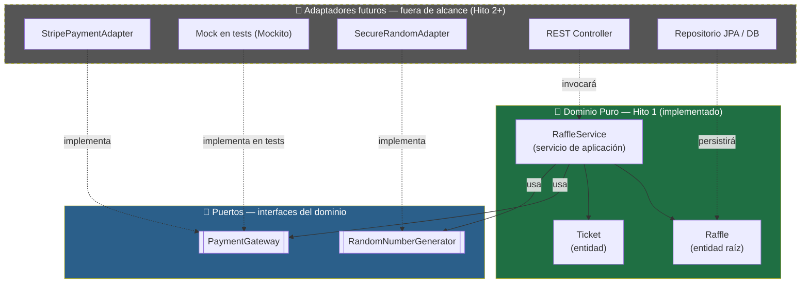
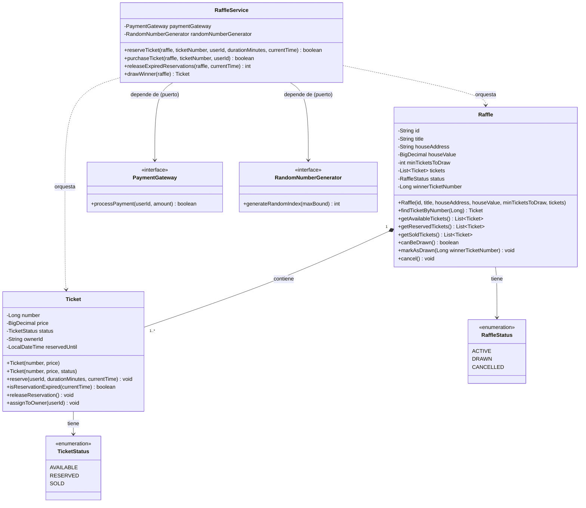
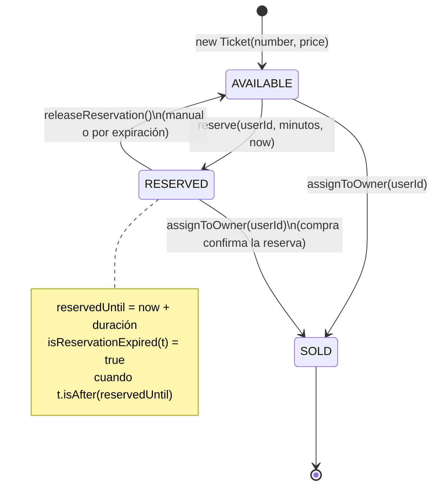
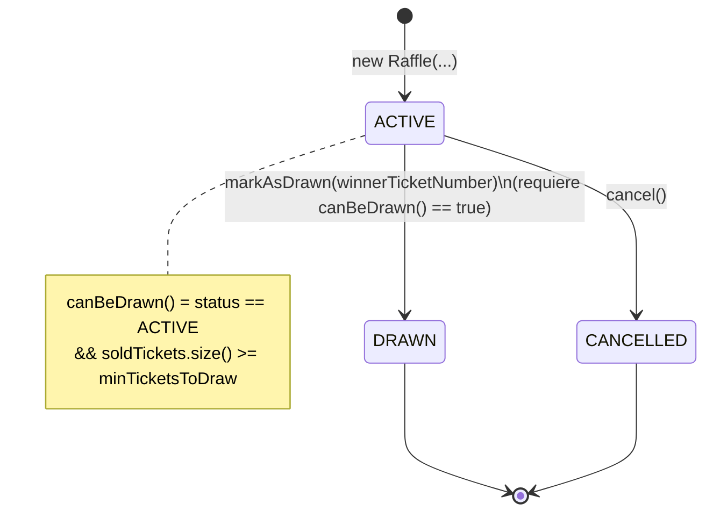
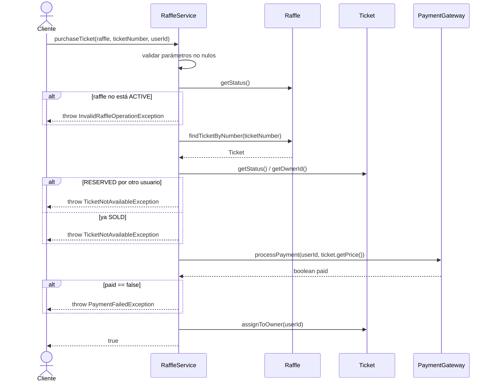
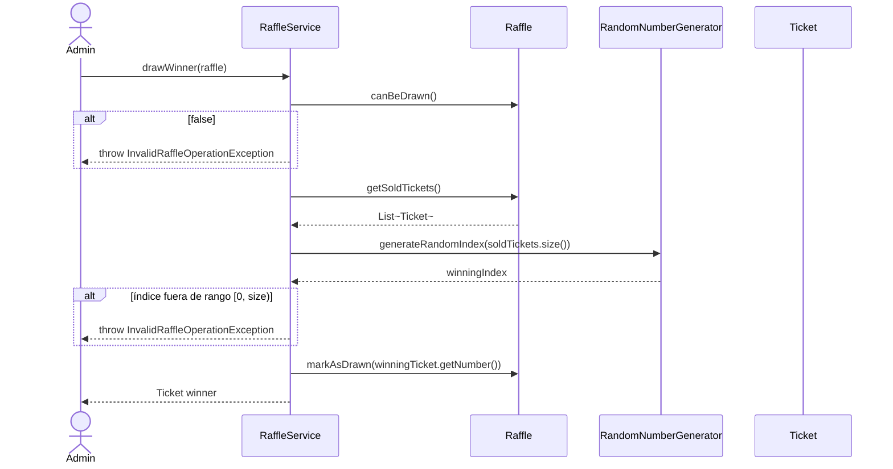
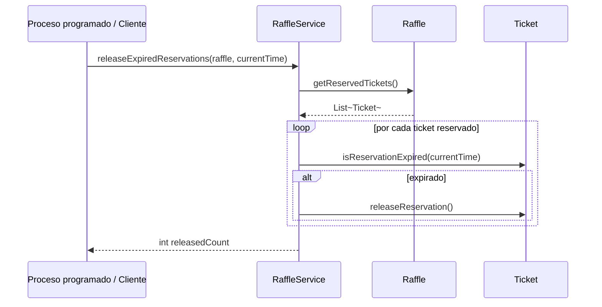

# 🏠 ClickTuCasa — Ticketera de Rifas de Casas Online

> **Hito 1: Core de Entidades de Dominio Puro, Suite Automatizada con JUnit 5 / Mockito y Cobertura 100% (JaCoCo)**
> *Programa Java — Globant Talento Ready / Desafío Latam*


---

## 📑 Tabla de contenidos

1. [Título y resumen del proyecto](#-1-título-y-resumen-del-proyecto)
2. [Contexto del curso y alcance del Hito 1](#-2-contexto-del-curso-y-alcance-del-hito-1)
3. [Arquitectura del dominio](#-3-arquitectura-del-dominio-clean-architecture--ports--adapters)
4. [Estructura de carpetas](#-4-estructura-de-carpetas)
5. [Modelo de dominio en profundidad](#-5-modelo-de-dominio-en-profundidad)
6. [Reglas de negocio e invariantes](#-6-reglas-de-negocio-e-invariantes)
7. [Servicio de aplicación: `RaffleService`](#-7-servicio-de-aplicación-raffleservice)
8. [Manejo de excepciones](#-8-manejo-de-excepciones)
9. [Estrategia de testing](#-9-estrategia-de-testing)
10. [Cobertura de código (JaCoCo)](#-10-cobertura-de-código-jacoco)
11. [Cómo ejecutar el proyecto](#-11-cómo-ejecutar-el-proyecto)
12. [Decisiones de diseño y trade-offs](#-12-decisiones-de-diseño-y-trade-offs)
13. [Limitaciones conocidas y próximos pasos](#-13-limitaciones-conocidas-y-próximos-pasos)
14. [Créditos](#-14-créditos)

---

## 📋 1. Título y Resumen del Proyecto

**ClickTuCasa** es el motor de dominio central (*Pure Domain Core*) para una plataforma web de venta de entradas y sorteo aleatorio transparente de rifas de casas online.

En este **Hito 1**, se implementa el modelo de negocio puro en **Java 17 LTS** (compatible hacia adelante con Java 21) aplicando **Test-Driven Development (TDD)** y arquitectura de **Puertos y Adaptadores (Clean Architecture)**. El dominio no posee dependencias de frameworks externos (sin Spring Boot, sin JPA/Hibernate, sin controladores HTTP), garantizando la máxima rigurosidad técnica, mantenibilidad y desacoplamiento.

En términos de negocio, el sistema modela el ciclo de vida completo de una rifa de una casa:

- Una **rifa** (`Raffle`) se crea con un conjunto fijo de **boletos** (`Ticket`), un valor de la vivienda y un número mínimo de boletos vendidos para poder sortear.
- Un usuario puede **reservar** un boleto temporalmente (con expiración) o **comprarlo** directamente, lo que dispara un pago a través de una pasarela externa.
- Cuando se alcanza el mínimo de boletos vendidos, la rifa puede **sortearse**, eligiendo un boleto ganador entre los vendidos mediante un generador de números aleatorios externo.
- Una rifa puede **cancelarse** en cualquier momento antes de ser sorteada.

---

## 🎓 2. Contexto del Curso y Alcance del Hito 1

Este repositorio corresponde a la **Unidad 1 — Fundamentos de Calidad y TDD en Java** del programa *Java — Globant Talento Ready*. El foco pedagógico de este hito es exclusivamente el **núcleo de dominio puro**, por lo que **deliberadamente no incluyen**:

| Fuera de alcance en Hito 1 | Motivo |
|---|---|
| Framework web (Spring Boot, controladores REST) | El foco es la lógica de negocio aislada, sin acoplarla a HTTP |
| Persistencia (JPA/Hibernate, bases de datos) | Los `Ticket` y `Raffle` viven en memoria durante los tests |
| Adaptadores reales de pago y aleatoriedad | `PaymentGateway` y `RandomNumberGenerator` son *puertos* (interfaces); sus implementaciones reales llegarán en hitos posteriores |
| Autenticación / autorización | No hay concepto de sesión de usuario, solo un `userId` de tipo `String` |

Esta separación es intencional: es el punto de partida de una **arquitectura hexagonal**, donde el dominio no sabe (ni le importa) qué tecnología concreta procesará los pagos o persistirá los datos.

---

## 🏛️ 3. Arquitectura del Dominio (Clean Architecture / Ports & Adapters)

El proyecto sigue el patrón **Ports & Adapters (Arquitectura Hexagonal)**. El dominio (`Raffle`, `Ticket`, `RaffleService`) es el centro del sistema y solo se comunica con el mundo exterior a través de **interfaces (puertos)**. En este hito no existen adaptadores concretos: solo se definen los puertos y se simulan con **mocks de Mockito** en los tests.



### Principios de diseño aplicados

- **Zero Frameworks Mágicos**: Java 17 puro, sin anotaciones de persistencia ni inyección de dependencias web.
- **Inyección por constructor**: `RaffleService` recibe sus puertos (`PaymentGateway`, `RandomNumberGenerator`) obligatoriamente en el constructor y los valida con `Objects.requireNonNull`.
- **Inversión de dependencias**: el dominio define las interfaces (`domain.port`); las implementaciones concretas dependerán del dominio, nunca al revés.
- **Entidades ricas, no anémicas**: `Raffle` y `Ticket` protegen sus propios invariantes (validaciones en constructor y en cada método de transición de estado), en vez de exponer setters públicos.
- **Inmutabilidad donde aplica**: los campos identificadores (`id`, `number`, `price`, etc.) son `final`; `getTickets()` devuelve una vista `Collections.unmodifiableList(...)`.
- **Patrón AAA estricto**: todos los tests JUnit 5 están segmentados con `// ARRANGE`, `// ACT`, `// ASSERT`.
- **Aislamiento con Mockito**: las pruebas de `RaffleService` simulan `PaymentGateway` y `RandomNumberGenerator` con `@Mock`, `when(...).thenReturn(...)` y `verify(...)`.
- **Excepciones de negocio explícitas**: cada regla violada lanza una excepción de dominio específica, verificada con `assertThrows`.

---

## 📂 4. Estructura de Carpetas

```plaintext
Hito de la unidad 01 Fundamentos de Calidad y TDD en JAVA/
├── pom.xml                                  # Configuración Maven: deps, compiler, JaCoCo
├── README.md                                # Este documento
├── ANALISIS_COBERTURA_JACOCO_RESOLUCION.md  # Caso de estudio: rama huérfana en Ticket.java
│
├── src/
│   ├── main/java/domain/
│   │   ├── exception/                       # Excepciones de negocio (unchecked)
│   │   │   ├── InvalidRaffleOperationException.java
│   │   │   ├── InvalidTicketPriceException.java
│   │   │   ├── PaymentFailedException.java
│   │   │   ├── TicketNotAvailableException.java
│   │   │   └── TicketNotFoundException.java
│   │   │
│   │   ├── model/                           # Entidades y value-objects del dominio
│   │   │   ├── Raffle.java                  # Entidad raíz: agrega Tickets, controla el sorteo
│   │   │   ├── RaffleStatus.java            # enum: ACTIVE, DRAWN, CANCELLED
│   │   │   ├── Ticket.java                  # Entidad: reserva, compra, expiración
│   │   │   └── TicketStatus.java            # enum: AVAILABLE, RESERVED, SOLD
│   │   │
│   │   ├── port/                            # Interfaces (puertos) que el dominio consume
│   │   │   ├── PaymentGateway.java          # Puerto de salida: procesar pagos
│   │   │   └── RandomNumberGenerator.java   # Puerto de salida: aleatoriedad del sorteo
│   │   │
│   │   └── service/
│   │       └── RaffleService.java           # Orquestador de casos de uso (application service)
│   │
│   └── test/java/domain/
│       ├── model/
│       │   ├── RaffleTest.java              # 14 tests unitarios
│       │   └── TicketTest.java              # 16 tests unitarios
│       └── service/
│           └── RaffleServiceTest.java       # 18 tests con Mockito
│
└── target/site/jacoco/                      # Reporte HTML de cobertura (generado por Maven)
```

> 🔤 Todo el código fuente está escrito **100% en inglés**, tal como exige la rúbrica de evaluación; la documentación (README y caso de estudio) está en español para facilitar la revisión académica.

---

## 🧬 5. Modelo de Dominio en Profundidad

### 5.1 Diagrama de clases



### 5.2 Ciclo de vida de un `Ticket`



### 5.3 Ciclo de vida de un `Raffle`



> ⚠️ Nótese la asimetría intencional: un `Raffle` **DRAWN** es un estado terminal — no puede cancelarse ni volver a sortearse — mientras que un `Ticket` **SOLD** también es terminal dentro de su propio ciclo de vida (no puede liberarse ni re-reservarse).

---

## ⚖️ 6. Reglas de Negocio e Invariantes

### `Ticket`

| # | Regla | Excepción si se viola |
|---|---|---|
| 1 | El número de boleto debe ser positivo (`> 0`) y no nulo | `IllegalArgumentException` |
| 2 | El precio debe ser mayor a cero y no nulo | `InvalidTicketPriceException` |
| 3 | Solo puede reservarse un boleto en estado `AVAILABLE` | `TicketNotAvailableException` |
| 4 | `reserve()` exige `userId` no vacío y duración positiva | `IllegalArgumentException` |
| 5 | No puede asignarse (venderse) un boleto ya `SOLD` | `TicketNotAvailableException` |
| 6 | `releaseReservation()` es una operación *no-op* segura si el boleto no está `RESERVED` | — (no lanza excepción) |
| 7 | `isReservationExpired()` siempre retorna `false` si el estado no es `RESERVED` o si `reservedUntil` es `null` | — |

### `Raffle`

| # | Regla | Excepción si se viola |
|---|---|---|
| 1 | `id`, `title`, `houseAddress` no pueden ser nulos ni vacíos/en blanco | `IllegalArgumentException` |
| 2 | `houseValue` debe ser mayor a cero | `IllegalArgumentException` |
| 3 | `minTicketsToDraw` debe ser positivo | `IllegalArgumentException` |
| 4 | La rifa debe crearse con al menos un boleto | `IllegalArgumentException` |
| 5 | Solo puede sortearse (`markAsDrawn`) una rifa `ACTIVE` que cumpla `canBeDrawn()` | `InvalidRaffleOperationException` |
| 6 | El boleto ganador debe estar en estado `SOLD` | `InvalidRaffleOperationException` |
| 7 | No puede cancelarse una rifa ya `DRAWN` | `InvalidRaffleOperationException` |
| 8 | `getTickets()` expone una lista **inmodificable** para evitar mutaciones externas no controladas | — |

### `RaffleService` (reglas de orquestación)

| # | Regla | Excepción si se viola |
|---|---|---|
| 1 | Todas las operaciones validan que sus parámetros no sean `null`/vacíos antes de tocar el dominio | `IllegalArgumentException` |
| 2 | No se puede reservar ni comprar en una rifa que no esté `ACTIVE` | `InvalidRaffleOperationException` |
| 3 | Un boleto `RESERVED` por **otro** usuario no puede ser comprado por un tercero | `TicketNotAvailableException` |
| 4 | Un boleto `RESERVED` por el **mismo** usuario sí puede completarse como compra | — (camino feliz) |
| 5 | Si `PaymentGateway.processPayment(...)` retorna `false`, el boleto **no cambia de estado** | `PaymentFailedException` |
| 6 | El índice generado por `RandomNumberGenerator` debe estar dentro de `[0, soldTickets.size())` | `InvalidRaffleOperationException` |

---

## 🧠 7. Servicio de Aplicación: `RaffleService`

`RaffleService` es el **orquestador de casos de uso**: no contiene reglas de negocio propias del dominio (esas viven en `Raffle`/`Ticket`), sino que coordina entidades y puertos externos.

| Método | Propósito | Colabora con |
|---|---|---|
| `reserveTicket(...)` | Reserva temporalmente un boleto para un usuario | `Raffle`, `Ticket` |
| `purchaseTicket(...)` | Compra un boleto, cobrando a través del `PaymentGateway` | `Raffle`, `Ticket`, `PaymentGateway` |
| `releaseExpiredReservations(...)` | Libera todas las reservas vencidas de una rifa | `Raffle`, `Ticket` |
| `drawWinner(raffle)` | Sortea un ganador entre los boletos vendidos usando `RandomNumberGenerator` | `Raffle`, `RandomNumberGenerator` |

### 7.1 Secuencia: compra de un boleto (`purchaseTicket`)



### 7.2 Secuencia: sorteo del ganador (`drawWinner`)



### 7.3 Secuencia: liberación de reservas vencidas (`releaseExpiredReservations`)



---

## 🚨 8. Manejo de Excepciones

Todas las excepciones de negocio son **unchecked** (extienden `RuntimeException`), siguiendo la convención de que las reglas de dominio violadas son errores de programación/flujo, no condiciones recuperables por el llamador en tiempo de compilación.

| Excepción | Se lanza cuando… |
|---|---|
| `InvalidTicketPriceException` | El precio de un `Ticket` es nulo, cero o negativo |
| `TicketNotAvailableException` | Se intenta reservar/comprar/asignar un boleto que no está en un estado válido para la operación |
| `TicketNotFoundException` | Se busca un `ticketNumber` que no existe dentro de la rifa |
| `InvalidRaffleOperationException` | Se intenta sortear o cancelar una rifa en un estado incompatible, o el sorteo no cumple sus precondiciones |
| `PaymentFailedException` | El `PaymentGateway` externo rechaza el pago |
| `IllegalArgumentException` (nativa de Java) | Parámetros de entrada nulos, vacíos o fuera de rango en constructores y métodos públicos |
| `NullPointerException` (vía `Objects.requireNonNull`) | Se instancia `RaffleService` con algún puerto nulo |

---

## 🧪 9. Estrategia de Testing

El proyecto sigue **Test-Driven Development (TDD)** con **JUnit 5** como framework de pruebas y **Mockito** para aislar `RaffleService` de sus dependencias externas (puertos).

### 9.1 Convenciones aplicadas

- **Patrón AAA explícito**: cada test está comentado con `// ARRANGE`, `// ACT`, `// ASSERT` (o `// ACT & ASSERT` cuando la acción y la verificación son atómicas, como en `assertThrows`).
- **Nombres descriptivos + `@DisplayName`**: cada test documenta en lenguaje natural el comportamiento esperado, facilitando la lectura del reporte de Surefire.
- **Mocks con `@ExtendWith(MockitoExtension.class)`**: `RaffleServiceTest` inyecta `PaymentGateway` y `RandomNumberGenerator` simulados con `@Mock`.
- **Verificación de interacciones**: se usa `verify(...)` y `verifyNoInteractions(...)` para confirmar que, por ejemplo, el gateway de pago **no** se invoca si la validación falla antes.
- **Cobertura de caminos huérfanos**: se investigan explícitamente las ramas de operadores booleanos compuestos (`||`, `&&`) — ver [caso de estudio](#-caso-de-estudio-cobertura-de-ramas) más abajo.

### 9.2 Inventario de la suite de pruebas

| Clase de test | Tests | Qué cubre |
|---|---:|---|
| `TicketTest` | 16 | Constructores, validaciones, reserva, expiración, liberación, asignación a dueño |
| `RaffleTest` | 14 | Constructor, invariantes, búsqueda de boletos, categorización por estado, sorteo, cancelación |
| `RaffleServiceTest` | 18 | Orquestación de casos de uso con `PaymentGateway`/`RandomNumberGenerator` mockeados |
| **Total** | **48** | Dominio completo (modelo + servicio) |

Para ejecutar la suite y ver el detalle de cada test:

```bash
mvn clean test
```

Los reportes por clase quedan disponibles en `target/surefire-reports/`.

---

## 📊 10. Cobertura de Código (JaCoCo)

El `pom.xml` configura una **regla de verificación (`check`) a nivel de CLASE** que exige `minimum = 1.00` (100%) tanto en cobertura de **líneas** como de **ramas**. Si esta regla no se cumple, `mvn verify` falla el build — es una red de seguridad de calidad, no solo un reporte informativo.

### 10.1 Resultado real de cobertura (extraído de `target/site/jacoco/jacoco.csv`)

| Paquete | Clase | Instrucciones | Ramas | Líneas |
|---|---|---:|---:|---:|
| `domain.service` | `RaffleService` | 247/247 (100%) | 46/46 (100%) | 60/60 (100%) |
| `domain.model` | `Raffle` | 265/265 (100%) | 42/42 (100%) | 60/60 (100%) |
| `domain.model` | `Ticket` | 170/170 (100%) | 30/30 (100%) | 44/44 (100%) |
| `domain.model` | `RaffleStatus` / `TicketStatus` | 21/21 c/u (100%) | N/A | 4/4 c/u (100%) |
| `domain.exception` | 5 clases | 4/4 c/u (100%) | N/A | 2/2 c/u (100%) |
| **TOTAL** | — | **744/744 (100%)** | **118/118 (100%)** | — |

Para generar y visualizar el reporte HTML interactivo localmente:

```bash
mvn clean test
mvn jacoco:report
```

Luego abrir en el navegador:

```plaintext
target/site/jacoco/index.html
```

### 10.2 Caso de estudio: cobertura de ramas

Durante el desarrollo, `Ticket.isReservationExpired()` quedó inicialmente en **98% de cobertura de ramas** debido a un camino huérfano en la condición compuesta `if (status != RESERVED || reservedUntil == null)`: ninguna prueba cubría el caso `status == RESERVED` **y** `reservedUntil == null` simultáneamente (posible tras usar el constructor con estado explícito).

La solución aplicada fue: (1) refactorizar la condición en dos *guard clauses* independientes, y (2) agregar el test `shouldReturnFalseForExpirationWhenReservedUntilIsNull()`. El análisis completo — con la matriz de evaluación booleana y el diagrama de bifurcación de bytecode — está documentado en:

📄 **[ANALISIS_COBERTURA_JACOCO_RESOLUCION.md](ANALISIS_COBERTURA_JACOCO_RESOLUCION.md)**

---

## 🚀 11. Cómo Ejecutar el Proyecto

### 11.1 Requisitos previos

- **JDK 17** o superior (el proyecto compila con `--release 17`; es compatible con ejecutarse bajo JDK 21)
- **Apache Maven 3.8+**
- No requiere base de datos, contenedores ni variables de entorno — es un módulo Maven autocontenido

### 11.2 Comandos principales

```bash
# Compilar el proyecto
mvn compile

# Ejecutar toda la suite de pruebas automatizadas (JUnit 5 + Mockito)
mvn clean test

# Generar el reporte de cobertura de código en formato HTML (JaCoCo)
mvn jacoco:report

# Ejecutar tests + generar reporte + validar la regla de cobertura 100% (falla el build si no se cumple)
mvn clean verify
```

### 11.3 Dependencias declaradas (`pom.xml`)

| Dependencia | Versión | Alcance | Uso |
|---|---|---|---|
| `junit-jupiter-api` / `-engine` / `-params` | 5.10.2 | `test` | Framework de pruebas JUnit 5 |
| `mockito-core` | 5.11.0 | `test` | Mocking de puertos (`PaymentGateway`, `RandomNumberGenerator`) |
| `mockito-junit-jupiter` | 5.11.0 | `test` | Integración `@ExtendWith(MockitoExtension.class)` |
| `jacoco-maven-plugin` | 0.8.11 | build | Cobertura de código + regla de verificación |
| `maven-compiler-plugin` | 3.13.0 | build | Compilación con `source`/`target` = 17 |
| `maven-surefire-plugin` | 3.2.5 | build | Ejecución de la suite de tests |

---

## 🧭 12. Decisiones de Diseño y Trade-offs

- **¿Por qué no usar Lombok o records?** Se optó por clases explícitas con constructores validados y getters manuales para maximizar la legibilidad pedagógica de las invariantes de negocio, aunque implica más código repetitivo.
- **¿Por qué excepciones unchecked en vez de checked?** Las excepciones de dominio representan violaciones de reglas de negocio (no errores recuperables de I/O), por lo que forzar `throws` en cada firma de método degradaría la legibilidad sin aportar seguridad real.
- **¿Por qué inyectar `PaymentGateway` y `RandomNumberGenerator` como interfaces?** Para mantener el dominio 100% testeable sin I/O real (red, `SecureRandom`) y para permitir sustituir la implementación (Stripe, MercadoPago, `SecureRandom`, etc.) sin tocar la lógica de negocio — el corazón del patrón Ports & Adapters.
- **¿Por qué `Raffle.getTickets()` retorna una lista inmodificable?** Para evitar que código externo mute la colección interna sin pasar por los métodos de dominio (`markAsDrawn`, etc.), preservando los invariantes del agregado.

---

## 🔭 13. Limitaciones Conocidas y Próximos Pasos

Estas son observaciones honestas sobre el alcance actual, útiles como guía para los siguientes hitos del curso:

- **Sin copia defensiva en el constructor de `Raffle`**: la lista `tickets` recibida se asigna directamente (`this.tickets = tickets`). Si el llamador conserva una referencia a la lista original y la modifica externamente, podría alterar el estado interno del agregado. `getTickets()` sí protege la *salida*, pero no la *entrada*.
- **Sin concurrencia**: no hay sincronización ni control de condiciones de carrera; dos reservas simultáneas sobre el mismo boleto en un entorno multi-hilo no están contempladas en este hito (adecuado para un dominio puro sin persistencia concurrente todavía).
- **Sin adaptadores reales**: `PaymentGateway` y `RandomNumberGenerator` no tienen implementación de producción — es el trabajo esperado de los próximos hitos (p. ej. un adaptador con `java.security.SecureRandom` y un adaptador HTTP hacia una pasarela de pago).
- **Sin capa de aplicación expuesta (API REST)**: `RaffleService` está pensado para ser invocado por un controlador (Spring Web, Javalin, etc.) que aún no existe en este repositorio.
- **Sin persistencia**: todas las entidades viven en memoria durante la ejecución de los tests; no hay repositorio ni mapeo a base de datos.

**Roadmap sugerido para hitos futuros:**

1. Adaptadores concretos para `PaymentGateway` (pasarela real o sandbox) y `RandomNumberGenerator` (`SecureRandom`).
2. Capa de persistencia (repositorio + adaptador JPA o similar) detrás de un puerto `RaffleRepository`.
3. Capa de aplicación HTTP (controladores REST) que exponga los casos de uso de `RaffleService`.
4. Manejo de concurrencia para reservas simultáneas (locking optimista o similar).
5. Documentación de contrato de API (OpenAPI/Swagger) una vez exista la capa REST.

---

## 👤 14. Créditos

Proyecto desarrollado como entregable del **Hito 1 — Unidad 1: Fundamentos de Calidad y TDD en Java**, dentro del programa **Java — Globant Talento Ready / Desafío Latam**.
