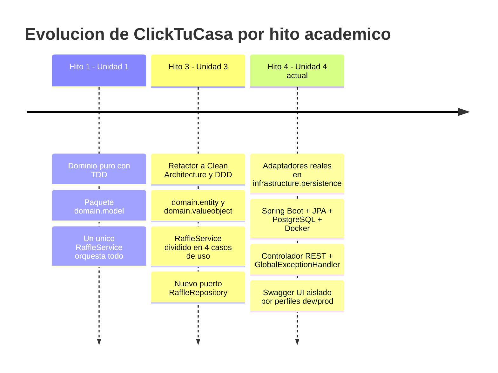

# 🏠 ClickTuCasa — Microservicio de Rifas de Casas (Spring Boot + PostgreSQL + Docker)

> **Unidad 4: Microservicios con Spring Boot, PostgreSQL y Docker — API REST persistente, documentada con Swagger/OpenAPI y protegida por perfiles (Hito 4)**
> *Programa Java — Globant Talento Ready / Desafío Latam*


> 📎 **Nota de versión.** Este documento describe el estado **vigente** del código (Unidad 4: microservicio Spring Boot persistente y documentado — Hito 4). Las versiones anteriores del proyecto se conservan, sin cambios, como anexos históricos:
> - **[README_HITO3.md](./README_HITO3.md)** — Unidad 3: refactor a Clean Architecture + DDD (dominio puro, casos de uso, sin infraestructura real).
> - **[README_HITO1.md](./README_HITO1.md)** — Unidad 1: dominio construido con TDD antes del refactor a capas.
>
> El modelo de dominio, las reglas de negocio y la estrategia de testing del núcleo (`domain` y `application.usecase`) **no cambiaron** en este hito — están documentadas en detalle en `README_HITO3.md` (secciones 5 a 12) y siguen siendo válidas. Este documento se enfoca en lo que el Hito 4 agrega: los adaptadores reales de infraestructura.

---

## 📑 Tabla de contenidos

1. [Resumen del proyecto](#-1-resumen-del-proyecto)
2. [Línea de tiempo del proyecto (Hito 1 → Hito 4)](#-2-línea-de-tiempo-del-proyecto-hito-1--hito-4)
3. [Arquitectura: de dominio puro a microservicio](#-3-arquitectura-de-dominio-puro-a-microservicio)
4. [Estructura de carpetas](#-4-estructura-de-carpetas)
5. [API REST (Pilar 1 — 3 pts)](#-5-api-rest-pilar-1)
6. [Persistencia real: Docker + PostgreSQL + JPA (Pilar 2 — 3 pts)](#-6-persistencia-real-docker--postgresql--jpa-pilar-2)
7. [Documentación OpenAPI y perfiles (Pilar 3 — 4 pts)](#-7-documentación-openapi-y-perfiles-pilar-3)
8. [Manejo global de errores](#-8-manejo-global-de-errores)
9. [Wiring de dependencias y adaptadores de puertos](#-9-wiring-de-dependencias-y-adaptadores-de-puertos)
10. [Cómo ejecutar el proyecto](#-10-cómo-ejecutar-el-proyecto)
11. [Decisiones de diseño y trade-offs](#-11-decisiones-de-diseño-y-trade-offs)
12. [Autoevaluación contra la rúbrica del Hito 4](#-12-autoevaluación-contra-la-rúbrica-del-hito-4)
13. [Limitaciones conocidas y próximos pasos](#-13-limitaciones-conocidas-y-próximos-pasos)
14. [Créditos](#-14-créditos)

---

## 📋 1. Resumen del Proyecto

**ClickTuCasa** es una plataforma de rifas de casas: se emiten boletos numerados para una vivienda determinada, los usuarios los reservan o compran, y al alcanzar un mínimo de boletos vendidos se sortea un ganador de forma transparente.

El núcleo de negocio (`domain` + `application.usecase`), construido en la Unidad 1 con TDD y refactorizado en la Unidad 3 a Clean Architecture/DDD, se mantiene **sin cambios** en este hito. Lo que la Unidad 4 agrega es todo lo que lo convierte en un **microservicio real, usable desde fuera**:

- Un **`RaffleController`** que expone los cinco flujos de negocio (crear, consultar, reservar, comprar, sortear, cancelar) como una API REST semántica bajo `/api/v1/raffles`.
- Un **`GlobalExceptionHandler`** que traduce cada excepción de dominio a una respuesta HTTP uniforme, con el código de estado correcto — nunca un stacktrace crudo.
- Un adaptador **`RaffleRepositoryAdapter`** que implementa el puerto `RaffleRepository` con **Spring Data JPA**, persistiendo en **PostgreSQL** real, levantado con **Docker Compose**.
- Adaptadores de los dos puertos que quedaban sin implementación (`PaymentGateway`, `RandomNumberGenerator`).
- Documentación interactiva con **Swagger UI / OpenAPI**, activa solo bajo el perfil `dev` y bloqueada por defecto.

En ningún momento de este trabajo se tocó el paquete `domain` con una anotación de framework: sigue siendo Java puro, tal como lo exige la rúbrica.

---

## 🎓 2. Línea de Tiempo del Proyecto (Hito 1 → Hito 4)



| Hito | Qué agrega | Dónde está documentado |
|---|---|---|
| Hito 1 (Unidad 1) | Dominio puro con TDD | `README_HITO1.md` |
| Hito 3 (Unidad 3) | Clean Architecture + DDD táctico | `README_HITO3.md` |
| **Hito 4** (Unidad 4) — **vigente** | Spring Boot, JPA/PostgreSQL, Docker, REST, Swagger | Este documento |

---

## 🏛️ 3. Arquitectura: de Dominio Puro a Microservicio

La regla heredada de la Unidad 3 se mantiene intacta: `domain` no conoce a nadie; `application.usecase` solo conoce al `domain`; todo lo que sabe de Spring, JPA, HTTP o Docker vive en `infrastructure`, y solo en `infrastructure`.

```
┌──────────────────────────────────────────────────────────────┐
│                    infrastructure (Hito 4)                    │
│                                                                │
│  web/controller/RaffleController  ← traduce HTTP ↔ dominio     │
│  web/exception/GlobalExceptionHandler  ← @RestControllerAdvice│
│  web/dto/*  ← Request/Response, nunca el dominio expuesto     │
│  persistence/RaffleRepositoryAdapter  ← implementa el puerto   │
│  persistence/entity/{Raffle,Ticket}Entity  ← @Entity JPA       │
│  payment/SimulatedPaymentGateway  ← implementa PaymentGateway  │
│  random/SecureRandomNumberGenerator  ← implementa el puerto    │
│  config/{UseCaseConfig,OpenApiConfig}  ← cablea todo lo demás  │
└───────────────────────────┬────────────────────────────────────┘
                            │ depende de (nunca al revés)
┌───────────────────────────▼────────────────────────────────────┐
│              application.usecase (Hito 3, sin cambios)          │
│  CreateRaffle · GetRaffle · ReserveTicket · PurchaseTicket ·     │
│  DrawWinner · ReleaseExpiredReservations · CancelRaffle          │
└───────────────────────────┬────────────────────────────────────┘
                            │ depende de (nunca al revés)
┌───────────────────────────▼────────────────────────────────────┐
│                   domain (Hito 1/3, sin cambios)                 │
│  Raffle · Ticket · value objects · excepciones · puertos         │
│  (RaffleRepository, PaymentGateway, RandomNumberGenerator)        │
│  — Java puro, cero anotaciones de Spring o JPA —                 │
└──────────────────────────────────────────────────────────────┘
```

**Único punto de acoplamiento cruzado:** `RaffleRepositoryAdapter` es la única clase que conoce tanto el modelo de dominio (`Raffle`, `Ticket`) como el modelo de persistencia (`RaffleEntity`, `TicketEntity`); traduce entre ambos en las dos direcciones (`toDomain` / `toEntity` / `mergeIntoEntity`) y nadie más en el proyecto necesita conocer esa traducción.

---

## 📂 4. Estructura de Carpetas

```
ClickTuCasa/
├── docker-compose.yml                          # PostgreSQL para el perfil dev — NUEVO
├── pom.xml                                     # Ahora hijo de spring-boot-starter-parent
├── README.md                                   # Este documento (vigente — Hito 4)
├── README_HITO3.md / README_HITO1.md           # Anexos históricos
├── src/main/java/com/clicktucasa/
│   ├── ClickTuCasaApplication.java             # main() — NUEVO
│   ├── domain/                                 # Sin cambios de framework (solo 2 factories nuevas, ver §11)
│   ├── application/usecase/                    # + CreateRaffle / GetRaffle / CancelRaffle — NUEVOS
│   └── infrastructure/
│       ├── web/
│       │   ├── controller/RaffleController.java        # NUEVO
│       │   ├── dto/ (Create/Reserve/PurchaseRequest, RaffleResponse, TicketResponse,
│       │   │         DrawWinnerResponse, ReleaseExpiredReservationsResponse, ErrorResponse)  # NUEVO
│       │   └── exception/GlobalExceptionHandler.java    # NUEVO
│       ├── persistence/
│       │   ├── RaffleRepositoryAdapter.java             # NUEVO — implementa RaffleRepository
│       │   ├── entity/{RaffleEntity,TicketEntity}.java  # NUEVO — @Entity JPA
│       │   └── repository/RaffleJpaRepository.java      # NUEVO — extends JpaRepository
│       ├── payment/SimulatedPaymentGateway.java         # NUEVO — implementa PaymentGateway
│       ├── random/SecureRandomNumberGenerator.java      # NUEVO — implementa RandomNumberGenerator
│       └── config/{UseCaseConfig,OpenApiConfig}.java    # NUEVO
└── src/main/resources/
    ├── application.yml                          # Base — Swagger deshabilitado — NUEVO
    └── application-dev.yml                      # Perfil dev — Postgres + Swagger habilitado — NUEVO
```

---

## 🌐 5. API REST (Pilar 1)

Todas las rutas son semánticas, viven bajo `/api/v1/raffles` y usan el verbo HTTP correcto para cada intención:

| Verbo y ruta | Caso de uso invocado | Código de éxito | Cuerpo de la petición |
|---|---|---|---|
| `POST /api/v1/raffles` | `CreateRaffleUseCase` | `201 Created` | `CreateRaffleRequest` (id, title, houseAddress, houseValue, minTicketsToDraw, totalTickets, ticketPrice) |
| `GET /api/v1/raffles/{raffleId}` | `GetRaffleUseCase` | `200 OK` | — |
| `POST /api/v1/raffles/{raffleId}/tickets/{ticketNumber}/reservations` | `ReserveTicketUseCase` | `200 OK` | `ReserveTicketRequest` (userId, durationMinutes) |
| `POST /api/v1/raffles/{raffleId}/tickets/{ticketNumber}/purchases` | `PurchaseTicketUseCase` | `200 OK` | `PurchaseTicketRequest` (userId) |
| `POST /api/v1/raffles/{raffleId}/draw` | `DrawWinnerUseCase` | `200 OK` | — |
| `POST /api/v1/raffles/{raffleId}/expired-reservations/release` | `ReleaseExpiredReservationsUseCase` | `200 OK` | — |
| `DELETE /api/v1/raffles/{raffleId}` | `CancelRaffleUseCase` | `204 No Content` | — |

`CreateRaffleUseCase`, `GetRaffleUseCase` y `CancelRaffleUseCase` son casos de uso **nuevos** de este hito (ver §11): el dominio ya sabía reservar, comprar, sortear y liberar reservas, pero no existía todavía una forma de crear, leer o cancelar una rifa completa — necesaria para poder ejercitar el flujo *crear → editar → borrar* que el profesor valida manualmente en Swagger UI.

Cada endpoint está anotado con `@Operation`/`@ApiResponses` (Pilar 3) y ningún controlador captura excepciones por su cuenta: todas suben hasta el `GlobalExceptionHandler` (§8).

---

## 🐘 6. Persistencia Real: Docker + PostgreSQL + JPA (Pilar 2)

- **`docker-compose.yml`** (raíz del repo): un servicio `db` con imagen `postgres:16-alpine`, credenciales de desarrollo y un **volumen persistente** (`postgres_data`) para no perder datos al reiniciar el contenedor.
- **Entidades JPA** en `infrastructure.persistence.entity`: `RaffleEntity` (`@Entity`, `@Table(name = "raffles")`, `@Id` de tipo `String`) y `TicketEntity` (`@Entity`, `@Table(name = "tickets")`, `@Id` autogenerado, `@ManyToOne` hacia `RaffleEntity`). Ninguna anotación de JPA aparece en `domain` — están exclusivamente en estas dos clases "cascarón".
- **Repositorio Spring Data**: `RaffleJpaRepository extends JpaRepository<RaffleEntity, String>` — CRUD resuelto sin una sola sentencia SQL manual.
- **Adaptador**: `RaffleRepositoryAdapter implements RaffleRepository`, la única clase que traduce entre el agregado de dominio (`Raffle`/`Ticket`) y las entidades JPA. Al guardar una rifa ya existente, actualiza la fila y sus boletos **en el lugar** (matcheados por `ticketNumber`), en vez de reemplazar todo el grafo — evita recrear filas innecesariamente en cada reserva o compra.

---

## 📖 7. Documentación OpenAPI y Perfiles (Pilar 3)

Los cuatro elementos que pide la rúbrica para el puntaje máximo, todos presentes:

1. **Dependencia** `springdoc-openapi-starter-webmvc-ui` en `pom.xml`.
2. **`OpenApiConfig`** (`infrastructure.config`) con el `@Bean OpenAPI` que define título, descripción y versión del contrato.
3. **Anotaciones de contrato**: `@Tag` en `RaffleController`, `@Operation`/`@ApiResponses` en cada endpoint, `@Schema` con `description` y `example` en cada campo de cada DTO.
4. **Aislamiento hermético por perfiles**: `application.yml` (base, sin perfil) deja `springdoc.api-docs.enabled` y `springdoc.swagger-ui.enabled` en `false`; `application-dev.yml` los sobrescribe a `true`. Cualquier entorno que no active explícitamente `spring.profiles.active: dev` queda con Swagger bloqueado por defecto.

Con el perfil `dev` activo:
- Swagger UI: `http://localhost:8080/swagger-ui.html`
- Contrato OpenAPI (JSON): `http://localhost:8080/api-docs`

---

## 🚨 8. Manejo Global de Errores

`GlobalExceptionHandler` (`@RestControllerAdvice`, en `infrastructure.web.exception`) es el único lugar del proyecto que traduce una excepción a una respuesta HTTP. Todas devuelven el mismo DTO `ErrorResponse { message, errorCode, timestamp }`:

| Excepción de dominio | Código HTTP | `errorCode` |
|---|---|---|
| `RaffleNotFoundException`, `TicketNotFoundException` | `404 Not Found` | `RESOURCE_NOT_FOUND` |
| `InvalidRaffleOperationException`, `TicketNotAvailableException` | `409 Conflict` | `BUSINESS_RULE_VIOLATION` |
| `PaymentFailedException` | `402 Payment Required` | `PAYMENT_FAILED` |
| `InvalidHouseAddressException`, `InvalidHouseValueException`, `InvalidTicketPriceException`, `IllegalArgumentException` | `400 Bad Request` | `INVALID_INPUT` |
| Validación `@Valid` fallida en un DTO (`MethodArgumentNotValidException`) | `400 Bad Request` | `VALIDATION_ERROR` |
| Cualquier otra excepción no anticipada | `500 Internal Server Error` | `INTERNAL_ERROR` (mensaje genérico, nunca el stacktrace) |

---

## 🧩 9. Wiring de Dependencias y Adaptadores de Puertos

- **`UseCaseConfig`** (`infrastructure.config`) declara un `@Bean` por cada caso de uso, inyectando el `RaffleRepository`/`PaymentGateway`/`RandomNumberGenerator` que Spring resuelve automáticamente. Los casos de uso mismos **no llevan ninguna anotación de Spring** — se instancian con `new` dentro de estos métodos `@Bean` — para que `application.usecase` siga siendo tan agnóstico de framework como `domain` y se pueda seguir testeando con Mockito puro, sin levantar contexto de Spring.
- **`SimulatedPaymentGateway`** (`infrastructure.payment`, `@Component`): implementa `PaymentGateway` aceptando cualquier pago con un monto positivo. No hay todavía una pasarela real (Stripe, Webpay, MercadoPago) — está fuera del alcance del Hito 4 — pero el puerto ya queda satisfecho end-to-end.
- **`SecureRandomNumberGenerator`** (`infrastructure.random`, `@Component`): implementa `RandomNumberGenerator` con `java.security.SecureRandom`, para que el sorteo (`DrawWinnerUseCase`) no sea predecible.

---

## 🚀 10. Cómo Ejecutar el Proyecto

### 10.1 Requisitos previos

- **JDK 17** o superior
- **Apache Maven 3.8+**
- **Docker** y **Docker Compose** (o, alternativamente, apuntar `application-dev.yml` a una base H2 en memoria si Docker no está disponible — ver §13)

### 10.2 Levantar la base de datos

```bash
docker compose up -d
```

### 10.3 Ejecutar la aplicación (perfil dev activo por defecto)

```bash
./mvnw spring-boot:run
# o, sin wrapper:
mvn spring-boot:run
```

### 10.4 Probar la API

- Swagger UI: http://localhost:8080/swagger-ui.html
- Documentación OpenAPI (JSON): http://localhost:8080/api-docs
- Flujo sugerido para validar de punta a punta (el mismo que usa el profesor para evaluar): crear una rifa (`POST /api/v1/raffles`), consultarla (`GET`), reservar o comprar un boleto, y finalmente cancelarla (`DELETE`) — todo desde el botón "Try it out" de Swagger.

### 10.5 Otros comandos útiles

```bash
mvn clean compile          # Compilar
mvn clean test             # Ejecutar la suite de tests (domain + application; ver §13)
mvn clean verify           # Tests + reporte JaCoCo + regla de cobertura 100% en domain/application
docker compose down        # Detener Postgres (los datos persisten en el volumen)
docker compose down -v     # Detener Postgres y borrar también los datos
```

---

## 🧭 11. Decisiones de Diseño y Trade-offs

- **Factories de reconstitución (`Ticket.reconstitute(...)`, `Raffle.reconstitute(...)`)**: los constructores de negocio de `Ticket` y `Raffle` deliberadamente no aceptan un boleto ya reservado/vendido ni una rifa ya sorteada/cancelada — esas transiciones solo deben ocurrir a través de `reserve()`, `assignToOwner()`, `markAsDrawn()`, `cancel()`. Pero `RaffleRepositoryAdapter` sí necesita reconstruir exactamente ese estado al leer una fila de la base de datos. La solución fue agregar un **factory estático de reconstitución** a cada clase, usado exclusivamente por la capa de persistencia: no se salta ninguna regla de negocio, solo restaura un snapshot de un estado que ya se alcanzó legítimamente en algún momento. Ambos factories tienen sus propios tests (`TicketTest`, `RaffleTest`) para mantener el gate de cobertura 100% sobre `domain`.
- **Tres casos de uso nuevos (`CreateRaffleUseCase`, `GetRaffleUseCase`, `CancelRaffleUseCase`)**: el dominio del Hito 3 solo cubría reservar/comprar/sortear/liberar sobre una rifa que ya existía. Para que la API se pueda probar de punta a punta sin datos precargados (tal como el profesor valida el hito, creando/editando/borrando un registro desde Swagger), hacía falta una forma de crear, leer y cancelar una rifa — se agregaron siguiendo exactamente el mismo patrón (una clase, una responsabilidad, inyección por constructor) que los cuatro casos de uso existentes.
- **`ddl-auto: update`** en `application-dev.yml`: se documenta aquí explícitamente — es una decisión consciente para desarrollo local (el esquema se ajusta automáticamente a las entidades), no un descuido. En un entorno productivo real correspondería `validate` + una herramienta de migración (Flyway/Liquibase), fuera del alcance de este hito.
- **La regla de cobertura JaCoCo del 100% ahora excluye `infrastructure`**: los Hitos 1 y 3 exigían 100% de cobertura en *todo* el código porque todo era `domain`/`application` puro. Con la infraestructura de Spring/JPA agregada en este hito, mantener 100% ahí exigiría tests de integración (`@SpringBootTest`, Testcontainers) que la propia rúbrica del Hito 4 declara **opcionales** ("el hito no los necesita"). Se optó por seguir exigiendo 100% en `domain` y `application` (donde ya existía y sigue vigente) y excluir explícitamente `infrastructure` de la regla, en vez de bajar el umbral global o dejar el build roto.
- **Adaptador de pago simulado en vez de uno real**: implementar una integración real (Stripe/Webpay/MercadoPago) no es parte de la rúbrica del Hito 4 y habría introducido credenciales y dependencias externas innecesarias; `SimulatedPaymentGateway` deja el puerto `PaymentGateway` completamente satisfecho y reemplazable más adelante sin tocar ningún caso de uso.

---

## ✅ 12. Autoevaluación contra la Rúbrica del Hito 4

| Checklist del Hito 4 | ¿Cumplido? | Dónde está |
|---|---|---|
| Controladores REST semánticos (`@RestController`, `@RequestMapping`) | ✅ | `RaffleController` bajo `/api/v1/raffles` |
| Verbos HTTP y códigos de respuesta correctos (200/201/204) | ✅ | Ver tabla de §5 |
| Interceptor centralizado `@RestControllerAdvice` | ✅ | `GlobalExceptionHandler` |
| Docker Compose para PostgreSQL con volumen persistente | ✅ | `docker-compose.yml` |
| Entidades JPA en `infrastructure/persistence`, nunca en `domain` | ✅ | `RaffleEntity`, `TicketEntity` |
| Repositorios que extienden `JpaRepository` | ✅ | `RaffleJpaRepository` |
| Dominio puro sin anotaciones de persistencia | ✅ | Sin cambios respecto al Hito 3 |
| Dependencia SpringDoc OpenAPI en `pom.xml` | ✅ | `springdoc-openapi-starter-webmvc-ui:2.6.0` |
| Clase de configuración OpenAPI (`@Bean OpenAPI`) | ✅ | `OpenApiConfig` |
| Swagger-UI accesible bajo perfil `dev` | ✅ | `application-dev.yml` |
| Swagger bloqueado en el perfil base | ✅ | `application.yml` (`enabled: false`) |
| `@Tag`/`@Operation`/`@ApiResponses` en los controladores | ✅ | `RaffleController` |
| `@Schema` en los DTOs | ✅ | Todos los DTOs de request/response |
| `.env` no commiteado | ✅ | Credenciales de desarrollo viven directamente en `docker-compose.yml`/`application-dev.yml`, sin secretos de producción |

---

## 🔭 13. Limitaciones Conocidas y Próximos Pasos

- **Sin autenticación**: Spring Security no forma parte de esta rúbrica ni se ha visto todavía en el curso. Cualquier cliente puede llamar a cualquier endpoint.
- **Sin integración real con el frontend**: el monorepo de React mencionado en el roadmap del proyecto todavía no consume esta API — queda para una sesión de integración posterior.
- **Alternativa H2**: si levantar Docker/PostgreSQL genera fricción en algún entorno, `application-dev.yml` puede apuntarse a una base H2 en memoria (dependencia ya declarada en `pom.xml` como `test`, movible a runtime si se decide usar esta alternativa) sin perder puntaje según la rúbrica del profesor — simplemente hay que declararlo en este README si se opta por ese camino.
- **Sin pasarela de pago real** ni **migraciones versionadas** (Flyway/Liquibase) — ambas fuera de alcance del Hito 4, ver §11.
- **Tests de infraestructura opcionales**: `RaffleController`, `RaffleRepositoryAdapter` y los adaptadores de puertos no tienen tests automatizados propios (la rúbrica los declara opcionales); se validan manualmente vía Swagger UI, siguiendo el mismo método que usa el profesor para evaluar. `domain` y `application.usecase` mantienen su cobertura 100% de siempre.
- **Roadmap sugerido más allá del Hito 4**: Spring Security (JWT), migraciones con Flyway, pasarela de pago real, y despliegue de este microservicio.

---

## 👤 14. Créditos

Proyecto desarrollado por **Daniel Araya Rocha** como parte del programa Java — Globant Talento Ready / Desafío Latam.

Ver también: [README_HITO3.md](./README_HITO3.md) · [README_HITO1.md](./README_HITO1.md)
